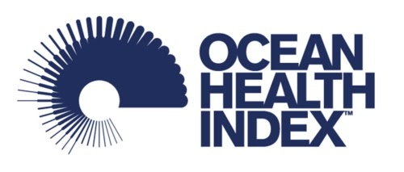
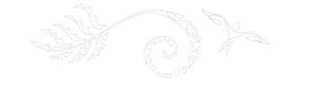
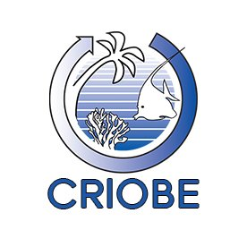
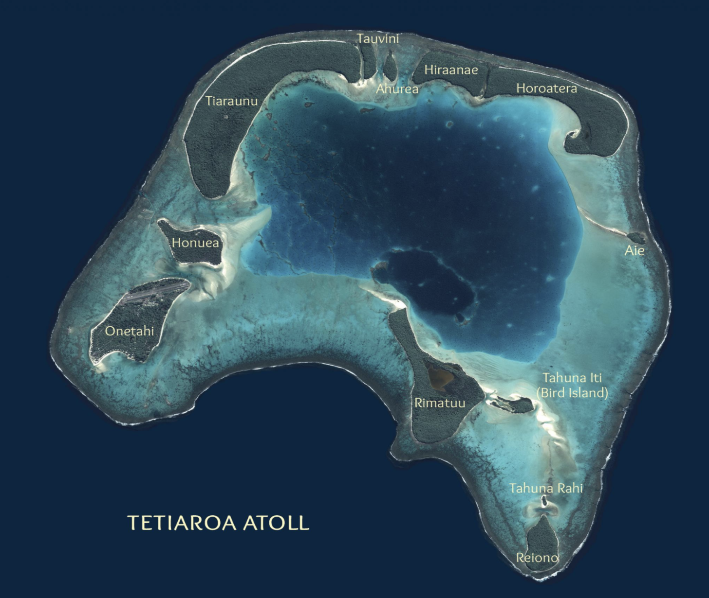

Compiled on `r date()`.

```{r setup, echo=FALSE, warning=FALSE, error=FALSE, message=FALSE}

library(knitr)
library(xtable)
library(pander)
library(dplyr)
library(tidyr)
library(ggplot2)
library(here)
library(tidyverse)

options(knitr.kable.NA = '')

```

***

# Ocean Health Index (OHI) Global Assessment

The Ocean Health Index (OHI) is a scientific framework used to measure how healthy oceans are. Understanding the state of our oceans is a first step towards ensuring they can continue providing humans benefits now and in the future. The Index describes how well we are sustainably managing 10 goals for ocean ecosystems which represent the full suite of benefits that people want and need from the ocean. These goals include: artisanal fishing opportunity, biodiversity, carbon storage, clean waters, coastal livelihoods and economies, coastal protection, food provision, natural products, sense of place, and tourism and recreation. Each goal is given a score ranging from 0 to 100, and the full suite of goal scores are then averaged to obtain an overall index score for each region. The global Ocean Health Index (OHI) assesses ocean health for 220 coastal countries and territories and has been conducted every year starting in 2012. For more information about the philosophy of the Ocean Health Index and model development see http://ohi-science.org/ohi-global/. 

OHI assessments have also been completed at smaller scales. Code, training, and support is also provided for independent groups interested in leading their own OHI assessments. These are called independent OHI assessments, or “OHI+ assessments”.

***
 
# OHI+ Tetiaroa Assessment

## Project Goal

This report is a summary of the methods and results for the Tetiaroa OHI+ assessment, completed in 2020 in partnership with the Tetiaroa 4site team. The Tetiaroa OHI+ assessment uses the best-available data to measure progress toward target conditions for benefits provided by the atoll’s marine ecosystems, resulting in benefit-specific and overall health scores on a scale of 0 to 100. 

<div class = "row">
<div class = "col-md-2">
<br><br>
</div>

<div class = "col-md-2">
<br><br>
</div>

<div class = "col-md-2">
<br><br>
</div>
</div>


## About Tetiaroa Atoll 

<center>

</center>
<br>

Tetiaroa Atoll is a group of 13 small islets (called motus) located 33 miles north of Tahiti. Originally settled over 4000 years ago, it served as a retreat for Tahitian royalty, until the arrival of British explorer James Cook in 1769. Despite falling under control of the British Crown for many years thereafter, it was regarded as sacred land by local people. Archaeological remains of temples and platforms built can still be found on various motus. 

In the 1920s, much of the natural vegetation was removed to make way for coconut palm plantations, which remained active until the early 1960s. In 1967, Tetiaroa was purchased by American actor Marlon Brando, and remains under the ownership of his trust today. The waters around the island fall under the governance of French Polynesia. 

In 2014, a luxury eco-resort was established on one of the islands, Onetahi. Called The Brando, is it managed by luxury resort developer Pacific Beachcomber, LLC. The resort strives to be as sustainable as possible by minimizing visitors' impact on the natural environment and creating programs that showcase the ecology and culture of Polynesia. Revenue from the resort helps support The Tetiaroa Society, a non-profit that acts as the main environmental steward of the island, supporting visiting researchers, giving tours to resort guests, and spearheading conservation and restoration projects. 

The ecology of Tetiaroa is similar to other small islands in the South Pacific. The motus native flora and vegetation consists of coastal strand vegetation, which can be classified into four main assemblages: *Pisonia-Pandanus-Guettarda-Hernandia-Cordia* forests, *Suriana-Pemphis-Scaevola-Heliotropisum shurblands*, *Ipomea-Lepturus-Triumfetta-Vigna-Boerhavia* creeping vines and *Cladium-Marsicus-Elocharis-Fimbristyles wetland sedges* (CASUP). Much of the native land vegetation has been displaced by coconut palms, although some of the smaller motus remain almost completely covered by native habitat. In addition to preserving the undisturbed motus, it is also an eventual goal to re-introduce certain native endemic plants that were extirpated in the 1970s and 1980.

Tetiaroa is surrounded by coral reefs and has additional reef structures in the lagoon, creating a highly productive and biodiverse marine environment. The reefs in Tetiaroa are relatively undisturbed due to the low number of people that live on or visit the island, and therefore environmental events such as coral bleaching, crown of thorns starfish outbreaks, and cyclones are currently the biggest threats to coral health. 

Essentially all human activities that occur on Tetiaroa make use of marine resources, from recreation to research. Therefore, the scope of this assessment encompasses all marine areas withing a 3 nautical mile-buffer of the motus, as well as all the land that makes up the motus. 

<br>


***

# Summary of the overall results

The results indicate that Tetiaroa's marine and coastal resources are supporting most of the goals assessed well, with an overall score of 76. The goals with the highest scores are and Iconic Species (90.02) and Tourism and Recreation (89.68). This suggests that many of the species with the most cultural and spiritual value to Tetiaroa are being protected well, and reflects the extraordinary effort tourism activities on the island have made to implement sustainable practices and minimize impact on the island's environment. 

The only goal that scored below 50 was Conservation Economy, which reflects the extent to which Tetiaroa's main environmental steward, The Tetiaroa Society, as been successful in generating funding and revenue to support conservation efforts on the island. The low score in this category highlights the continual need for resources to preserve ocean health on Tetiaroa - it may be difficult to sustain the high scores seen for other goals without improvement here in the future. 


**Figure X.X. OHI+ Tetiaroa Results** 


```{r score table, echo=FALSE,message=FALSE,warning=FALSE}
goals <- read_csv(here("region/conf/goals.csv")) %>%
  dplyr::select(goal, name, description)
scores <- read_csv(here("region/scores.csv")) %>%
  filter(dimension == "score" | dimension == "future" | dimension == "status") %>%
  dplyr::select(goal,dimension,score) %>%
  pivot_wider(id_cols ="goal", names_from = "dimension", values_from = "score") %>%
  filter(goal != "Index") %>%
  inner_join(.,goals, by = "goal") %>%
  dplyr::select(Goal = name, Status = status, Future = future, Score = score, Description = description) %>%
  arrange(desc(Score))


kable(scores, align = "l")
```


***

# Models: Methods

```{r goal functions, echo=FALSE, warning=FALSE, error=FALSE, results="asis"}
## data and functions used to list data layers in each goal
# data with information
# layers <- read.csv(here("metadata_documentation/layers_tet_base.csv"))
# targets <- read.csv(here("metadata_documentation/layers__targets.csv"))
# layers_web <- "http://ohi-science.org/ohi-global/layers.html"
# # function
# data_layers <- function(dimension, goal){ # goal = "ICO"; dimension=c("status", "trend")
#   
#   st <- targets[targets$goal == goal, ]
#   st <- st[st$dimension %in% dimension, ]
#   
# st <- st %>%
#   select(layer) %>%
#   unique()
# st_layers <- filter(layers, layer %in% st$layer) %>%
#   mutate(web_name = gsub(" ", "_", name)) %>%
#   mutate(web_name = tolower(web_name)) %>%
#   mutate(web_name = gsub("/", "", web_name)) %>%
#   mutate(info = sprintf("[%s](%s#%s) (%s): %s", name, layers_web, web_name, layer, description))
# cat(paste(st_layers$info, collapse="\n\n"))
# }
```

## Goals Included in Tetiaroa OHI+ Assessment:
The following goals were included in the Tetiaroa OHI+ assessment:

### Biodiversity (BD) 

<span style="color: #f2cf4a; font-family: Arial, sans-serif; font-size: large;">Score = 76.69</span>

The Biodiversity (BD) goal is made up of two subgoals, Habitats (HAB) and Species (SPP).


#### Habitats (HAB)

<span style="color: #f2cf4a; font-family: Arial, sans-serif; font-size: large;">Score = 70.09</span>

The habitat subgoal measures the average condition of marine habitats present in each region that provide critical habitat for a broad range of species (mangroves, coral reefs, seagrass beds, salt marshes, sea ice edge, and subtidal soft bottom). This subgoal is considered a proxy for the condition of the broad suite of marine species. For this assessment, we include the native vegetation of the motus as well as the coral reef habitats in this goal.

##### Current Status

The status of the habitat sub-goal, xhab, was assessed as the average of the condition estimates, C, for each habitat, k, present in a region; measured as the loss of habitat and/or % degradation of remaining habitat, such that:

$$
x_{hab}= \frac { \displaystyle\sum _{ i=1 }^{ N }{ { (C }_{ k } }) }{N},(Eq.1.1)
$$

where, C_k= Cc/Cr and N is the number of habitats in a region. $C_c$ is the current condition and $C_r$ is the reference condition specific to each k habitat present in the region (Table 5.2). This formulation ensures that each country is assessed only for those habitats that can exist (e.g., Canada is not assessed on the status of its nonexistent coral reefs).

**Table 1.1.** Habitat data Description of condition, extent, and trend calculations for habitat data (Note: extent is not used to calculate the habitat subgoal, but is used for the coastal protection and carbon storage goals). More information about the sources used to generate these values is located in Section 6 and Table 6.1.

| Habitat | Condition | Extent | Trend |
| :----- | :-----------------| :------------ | :--------- |
| Native land vegetation | Scored based on relative area of coconut palms, native forest, and landscaped area (see below) | Frank's map | No trend
| Coral reef | Used global OHI score for French Polynesia | Total extent of coral reef within 3 nm of Tetiaroa | Used global trend for French Polynesia

**Land Habitat** 

Because a long term goal for Tetiaroa is to restore abandoned coconut plantation areas to native vegetation, the condition score of the native land habitat will be based on the extent of coconut grove versus extent of native habitat that exists in Tetiaroa. We will also include altered habitat (ie landscaped) since much of the habitat on Onetahi has been altered for construction of the Brando. 

Frank used Google Earth to estimate the area of coconut grove, coconut grove and native habitat mix, and just native habitat. He also includes the estimated area of landscaped habitat on Onetahi. We will assign scores based on whether the motu is dominated by native vegetation or by coconut grove. Each motu will receive a score, and then the final score will be calculated using the average weighted by area of the motu. The summary below includes information about the native species and benefits they provide to the island, which is why we consider areas dominated by native species the ideal state of land habitat. Note: if the tree is designated on the Tetiaroa website as 'Polynesian Introduction' we still consider it native.

*Table 1.2. Dominant plant species based on plot surveys* 

| Motu | Dominant species | Native? | Notes |
| :----- | :--------- | :----- | :-------------------|
| Reiono | Pisonia grandis / Cabbage tree | yes | Important nesting site, helps protect against storm surge |
| Tiaraunu N | Cocos nucifera / Coconut palm | no | Coco plantations have made motus more vulnerable to storm surge and coastal erosion
| Tiaraunu S | Callophyllum inophyllum / Tamanu | yes | Introduced by native Polynesians, oil from its fruit used for many purposes |
| Rimatu | Pandanus tectorius / Screwpine | yes | Key food staple for native atoll inhabitants, used also for medicinal purposes and weaving | 
| Onetahi | Casuarina equisetifoilia / Ironwood | yes | Introduced by native Polynesians, can grow to 100 ft tall, symbol of the war god 'Oro |
| A'ie | Mixed forest | yes | No further details |

Between the report and the species profiles on the Tetiaroa Society we can see that the native ecosystem has many benefits compared to coconut groves. Also, while landscaped areas are most likely replacing removed or altered native habitat, we know from The Brando's website that they only use native plants and do their best to recreate the ecosystem. We therefore will score these areas slightly better than "only coconut grove". Each area provided by Frank was assigned a score, and then the scores were averaged weighted by the corresponding areas to get the over all score. See full scoring scheme below:

**Table 1.3. Scores for different vegetation types on Tetiaroa**  

| Vegetation Type | Score |
| :--------------- | :------------ |
| Only native vegetation | 1 |
| Native vegetation mixed with coconut grove | 0.5 |
| Landscaped area | 0.3 |
| Only coconut grove | 0 | 


The condition of the native land habitat was calculated by finding the weighted average of the scored land cover categories (Eq 1.2). 

$$
C_{land} = \frac { \displaystyle\sum _{ i=1 }^{ N }{ { (S }_{ i } } \times { A }_{ i }) }{ { { A } }  }, (Eq. 1.2) 
$$  
For every $i$ vegetation type, we multiplied the score $S_{i}$ from Table X.X, by the area $A_{i}$ of that vegetation type on Tetiaroa. These were divided by the total area $A$ to find the overall native land habitat condition. 

**Marine Habitat** 

The condition of the marine habitat was difficult to establish as temporal data on coral reef extent over time was not available. We therefore used the global score for French Polynesia as a substitute for coral health here. 

**global methods?**


##### Trend

Frank does not feel that the land vegetation makeup has changed much over the past 5 years, therefore the trend for land habitats was zero. For coral reefs, we substituted the 2020 global trend score for French Polynesia.  

##### Data
_Status and trend_

```{r HAB data st, results="asis", echo=FALSE}
#data_layers(goal="HAB", dimension=c("status", "trend"))
```

_Pressure_

```{r HAB data p, results="asis", echo=FALSE}
#data_layers(goal="HAB", dimension=c("pressure"))
```

_Resilience_

```{r HAB r, results="asis", echo=FALSE}
#data_layers(goal="HAB", dimension=c("resilience"))
```


#### Species (SPP) 

<span style="color: #f2cf4a; font-family: Arial, sans-serif; font-size: large;">Score = 83.29</span>

This subgoal aims to assess the average condition of the marine species within Tetiaroa based on their IUCN status. The target for the species subgoal is to have all species at a risk status of Least Concern.

##### Current Status
Species status was calculated as the area and status-weighted average of assessed species within Tetiaroa. Marine species distribution and threat category data mostly came from IUCN Red List of Threatened Species [http://www.iucnredlist.org](http://www.iucnredlist.org). Seabird distributions data came from Birdlife International [http://datazone.birdlife.org](http://datazone.birdlife.org).   

We scaled the lower end of the biodiversity goal to be 0 when 75% species are extinct, a level comparable to the five documented mass extinctions [@barnosky_has_2011] and would constitute a catastrophic loss of biodiversity. 

Threat weights, $w_{i}$, were assigned based on the IUCN threat categories status of each $i$ species, following the weighting schemes developed by Butchart et al. [-@butchart_improvements_2007] (Table 4.2). For the purposes of this analysis, we included only data for extant species for which sufficient data were available to conduct an assessment. We did not include the Data Deficient classification as assessed species following previously published guidelines for a mid-point approach [@schipper_status_2008; @hoffmann_impact_2010].

The status was calculated by first finding the average threat weight per taxonomic class (Eq. 1.3), in order to prevent one class from dominating the overall score. Certain classes, such as gastropoda, had many more species than other. We then found the average of all the classes (Eq. 1.4)


$$
\bar R_{class} = \frac { \displaystyle\sum _{ i=1 }^{ C }{ { w }_{ i } }  }{ { { N }_{c} }  }, (Eq. 1.3) 
$$
$$
\bar R_{spp} = \frac { \displaystyle\sum _{ i=1 }^{ N }{ { \bar R }_{ class } }  }{ { { N } }  }, (Eq. 1.4) 
$$
Where $C$ is the taxonomic class, $N_c$ are the total number of classes, $w$ is the threat weights, and $N$ is the total number of species. 

To convert $\bar R_{spp}$ into a score, we set a floor at 25% (representing a catastrophic loss of biodiversity, as noted above) and then rescaled to produce a $x_{spp}$ value between zero and one.

$$
x_{spp} = max \left( \frac { \bar R_{SPP} - .25 }{ .75 }, 0 \right), (Eq. 1.5)
$$


**Table 1.4. Weights for assessment of species status based on IUCN risk categories**

| Risk Category   | IUCN code | Weight|
|-----------------|-----------|-------|
| Extinct         |     EX    |  0.0  |
| Critically Endangered | CR  |  0.2  |
| Endangered      |     EN    |  0.4  |
| Vulnerable      |     VU    |  0.6  |
| Near Threatened |     NT    |  0.8  |
| Least Concern   |     LC    |  1.0  |


##### Trend
We calculate trend using data the IUCN provides for current and past assessments of species, which we use to estimate annual change in IUCN risk status for each species.  We then summarize these species trend values for Tetiaroa using the same general approach used to calculate status.

##### Data
_Status and trend_

```{r SPP data st, results="asis", echo=FALSE}
#data_layers(goal="SPP", dimension=c("status", "trend"))
```

_Pressure_

```{r SPP data p, results="asis", echo=FALSE}
#data_layers(goal="SPP", dimension=c("pressure"))
```

_Resilience_

```{r SPP r, results="asis", echo=FALSE}
#data_layers(goal="SPP", dimension=c("resilience"))
```


### Coastal Protection (CP) 

<span style="color: #f2cf4a; font-family: Arial, sans-serif; font-size: large;">Score = 84.92</span>

This goal aims to assess the amount of protection provided by marine and coastal habitats to coastal areas that people value, both inhabited (homes and other structures) and uninhabited (parks, special places, etc.). On Tetiaroa, both the coral reefs and native forest provide protection against storm surge from cyclones. Both habitats were therefore considered in calculated this goal. 

For an estimate of the extent of coral reefs, we used data from the Living Oceans Foundation French Polynesia report, which was published in 2017 to assess the condition of coral reefs based on the ratio of different benthic habitats on Tetiaroa. 

The Living Oceans Foundation is a non-profit dedicated to ocean protection rooted in science-based solutions. Their 5-year Global Reef Expedition was the largest coral reef survey and high resolution mapping expedition, with the goal of studying the health and resilience of reefs. The GRE mapped out benthic habitats in the Society Islands in 2012, including Tetiaroa. The final report where the habitat areas were published was released in 2017, but the data was collected in 2012. 

##### Current Status 

The status of this goal, $x_{cp}$, was calculated to be a function of the relative health of the habitats, $k$, weighted by their area and protectiveness rank (Table 5.4), such that:

$$
x_{cp} = \frac { \displaystyle\sum _{ k=1 }^{ N }{ { (h }_{ k } } \times { w }_{ k }\times { A }_{ k }) }{ \displaystyle\sum _{ k=1 }^{ N }{ { (w }_{ k }\times { A }_{ k }) }  }, (Eq. 1.6)
$$

where, $w$ is the rank weight of the habitat’s protective ability, $A$ is the area within a region for each $k$ habitat type, and $h$ is a measure of each habitat's condition:

$$
h = \frac { C_{ c } }{ { C }_{ r } }
$$

where, $C_c$ is current condition and $C_r$ is reference condition. Descriptions for how C was calculated for both land and marine habitats are outlined above in the HAB method description (4.1.1.1.1).

The native land habitat extent was calculated using Frank's area estimations of each habitat type. The extent of the coral habitat was calculated by finding the total area of benthic habitat with reef structure, using estimations from the 2012 LOF expedition (Table 1.5). We considered any habitat classification with "reef" or "coral" as evidence of reef extent, summing these areas to find the total reef extent.

**Table 1.5. Total area (km^2) of benthic habitat types in Tetiaroa** Modified from table on page 21 of the LOF French Polynesia Final Report (CITE).
```{r lof_table, echo=FALSE}
lof_table <- read.csv(here("documents/methods-results/metadata_documentation/fp_habtable_clean.csv"), na.strings="") %>% 
  dplyr::select(Habitat = habitat, Classification = classification, Area = Tetiaroa) %>% 
  filter(!is.na(Habitat)) %>% 
  filter(str_detect(Classification, pattern = "coral") | str_detect(Classification, pattern = "reef"))

kable(lof_table, align = "l")
```

The reference area for each habitat is treated as a fixed value; in cases where current area might exceed this reference value (e.g., through restoration), we cap the score at the maximum value (1.0). Although this does not give credit for restoration, data tend to be of poor quality making it difficult to determine true increases, and in general habitat restoration beyond reference values is extremely unlikely. Rank weights for the protective ability of each habitat for the Global OHI ($w_{k}$) come from previous work [@tallis_invest_2011]. Although this work does not include native atoll forest as a category, we ranked it equal to mangroves or salt marshes as they occupy a similar place that these habitats would (shoreline) and were highlighted by the Tetiaroa Society as important to preventing damage to storm surge on the island. 

**Table 1.6. Coastal protectiveness ranks**
Scores range from 1-4, with 4 being the most protective [@tallis_invest_2011].

Habitat | Protectiveness rank ($w$)
------- | -------------------------
Native land vegetation | 4
Coral reefs | 3 


#### Trend

The trend for this goal used the same metrics used for the HAB goal trend. For native land habitat, we assumed a 0 trend as the vegetation make up on Tetiaroa's atolls has not changed significantly over the past 5 years. For coral reefs, we used the 2020 global trend for French Polynesia. 

##### Data
_Status and trend_

```{r CP data st, results="asis", echo=FALSE}
#data_layers(goal="CP", dimension=c("status", "trend"))
```

_Pressure_

```{r CP data p, results="asis", echo=FALSE}
#data_layers(goal="CP", dimension=c("pressure"))
```

_Resilience_

```{r CP r, results="asis", echo=FALSE}
#data_layers(goal="CP", dimension=c("resilience"))
```

### Conservation Economy (CE)

<span style="color: #f2cf4a; font-family: Arial, sans-serif; font-size: large;">Score = 47.07</span>

The global OHI includes a measure of the jobs and revenue produced from marine-related industries, called the Livelihoods and Economies (LE) goal. Marine-related industries are clearly of huge value to many people, even those who do not directly participate in the industries but value community identity, tax revenue, and indirect economic and social impacts of a stable coastal economy. This goal is composed of two equally important sub-goals, livelihoods and economies, which are assessed across as many marine-related sectors as possible. Livelihoods includes two equally important sub-components, the number of jobs, which is a proxy for livelihood quantity, and the per capita average annual wages, which is a proxy for job quality. Economies is composed of a single component, revenue.

For Tetiaroa, we are modifying this model to include only one goal capturing the revenue generated by the Tetiaroa Society, which we are calling the Conservation Economy (CE). We felt that including all measures of LE made less sense, as there are very few full time residents on the island, and all of them are employed by The Brando or the Tetiaroa Society. Essentially all of the Tetiaroa Society's activities and expenditures are related to environmental and cultural conservation of the island, which is why we refer to this goal in this context as "Conservation Economy". Also, because a portion of the Tetiaroa Society's income comes from guest fees at the resort, there is a direct link between a healthy ocean or island environment that attracts tourism, and generating the funds necessary to help preserve it. 

We used the Tetiaroa's Society fundraising goal as the reference point, which breaks down as follows:

**Table 1.7. Ideal yearly budget for Tetiaroa Society Operations**

| Item | Yearly Cost | Description | 
| :------- | :--------: | :------------ |
| Operations | $700 K | Covers core staff and facilities maintenance / depreciation | 
| **Mission Programs:** |       |          |
| Conservation & Sustainable Use Plan | $ 250 K 
| Social-Ecological System Observatory | $750 K | Monitoring CASUP, data management, and establishing baselines for science |
| Science Programs | $100 K | Seed grants, equipment, meetings, workshops |
| Cultural and Educational Programs | $100 K |       |
| Blue Climate Initiative | $100 K |       |

**Total Yearly Budget Goal** = $2,000,000 

To measure the status of this goal, we used the 2018 and 2019 Tetiaroa Society reports for income in 2018 and 2019, and then $700,000 as the income for 2020 (per Neil and Frank's estimation). The current status was calculated by dividing the actual income by the ideal budget goal. 

$$
status_{ce}~=~ \frac { I_{yr}} { I_{ref} },  ~~(Eq ~4.17)
$$  

Where $I_{yr}$ is the yearly income, and $I_{yr,ref}$ is the yearly budget goal.  

##### Trend

The trend for this goal was calculated using only the three years of data we have available, rather than the usual five.

##### Data
_Status and trend_

```{r CE data st, results="asis", echo=FALSE}
#data_layers(goal="SPP", dimension=c("status", "trend"))
```

_Pressure_

```{r CE data p, results="asis", echo=FALSE}
#data_layers(goal="SPP", dimension=c("pressure"))
```

_Resilience_

```{r CE r, results="asis", echo=FALSE}
#data_layers(goal="SPP", dimension=c("resilience"))
```


### Sense of Place (SP) 

<span style="color: #f2cf4a; font-family: Arial, sans-serif; font-size: large;">Score = 84.41</span>

The Sense of Place (SP) goal attempts to capture the aspects of Tetiaroa's coastal and marine system that people value as part of their cultural identity. This definition includes people living near the ocean and those who live far from it but still derive a sense of identity or value from knowing particular places or species exist. This goal is calculated using two equally weighted subgoals: iconic species (ICO) and lasting special places (LSP).

#### Iconic Species (ICO) 

<span style="color: #f2cf4a; font-family: Arial, sans-serif; font-size: large;">Score = 90.02</span>

Iconic species are those that are relevant to local cultural identity through their relationship to one or more of the following: 1) traditional activities such as fishing, hunting or commerce; 2) local ethnic or religious practices; 3) existence value; and 4) locally-recognized aesthetic value (e.g., touristic attractions/common subjects for art such as whales). Ultimately, almost any species can be iconic to someone, and so the intent with this goal was to focus on those species widely seen as iconic from a cultural or existence value (rather than a livelihoods or extractive reason). Habitat-forming species were not included, nor were species harvested solely for economic or utilitarian purposes (even though they may be iconic to a sector or individual).

The Iconic Species subgoal aims to assess the conservation status of species that have particular value to Tetiaroa. We decided that for this assessment, our iconic species list would be the list of species highlighted on the [Tetiaroa Society's website](https://www.tetiaroasociety.org/index.php/island).


##### Current Status 

After compiling a list of species from this source, we pulled its conservation status using the IUCN RRedlist package and then assigned each species a score based on its conservation status. The overall score is determined by finding the average score per species class, and then taking the overall average among the classes (see Eq XX and XX above. The table below shows how each IUCN conservation status is scored: 

**Table 1.7. Weights for assessment of species status based on IUCN risk categories**

| Risk Category   | IUCN code | Weight|
|-----------------|-----------|-------|
| Extinct         |     EX    |  0.0  |
| Critically Endangered | CR  |  0.2  |
| Endangered      |     EN    |  0.4  |
| Vulnerable      |     VU    |  0.6  |
| Near Threatened |     NT    |  0.8  |
| Least Concern   |     LC    |  1.0  |


##### Trend 

We calculated trend using data the IUCN provides for current and past assessments of species, which we used to create a time series of average risk status for species within Tetiaroa. Because IUCN assessments are generally infrequent for any given species, we derive the trend as the annual change in risk status for each species across the previous twenty years, rather than a five-year window typical of other goals, and include only taxa with two or more IUCN assessments within the past 20 years.

##### Data
_Status and trend_

```{r ICO data st, results="asis", echo=FALSE}
#data_layers(goal="ICO", dimension=c("status", "trend"))
```

_Pressure_

```{r ICO data p, results="asis", echo=FALSE}
#data_layers(goal="ICO", dimension=c("pressure"))
```

_Resilience_

```{r ICO r, results="asis", echo=FALSE}
#data_layers(goal="ICO", dimension=c("resilience"))
```


#### Lasting Special Places (LSP)

<span style="color: #f2cf4a; font-family: Arial, sans-serif; font-size: large;">Score = 78.80</span>

The methods for the global OHI assessment use the extent of areas protected as a way to measure the aesthetic, spiritual, and cultural value people hold for a certain place. The model for this goal considers the inland coastal zone (up to 1 km inland) independently from, and equally weighted with, the offshore coastal zone (up to 3 nm offshore).  The status for this goal is calculated as:  

<br>

$$X_{LSP} = \frac{\left(\frac{Area_{P}}{Area_{P_{ref}}} + \frac{Area_{MPA}}{Area_{MPA_{ref}}}\right)}{2}$$

where: 

* $Area_{P}$ = Protected area for inland 1 km buffer
* ${Area_{P_{ref}}}$ = Reference value for inland protected area
* $Area_{MPA}$ = Marine protected area for offshore 3 nm buffer
* ${Area_{MPA_{ref}}}$ = Reference value for marine protected area within offshore 3 nm buffer
* $Ref$ = 30% of total area within buffer zone is protected
  
    
<br>

We used the methods above to assess protected areas in order to create a resilience layer (see X.X). However, because Tetiaroa does not feel as creating more protected areas is a primary goal, we adjusted these methods for the LSP goal. First, instead of just calculating protected area within 1km of the shore, we will treat all land areas as coastal land on Tetiaroa, since most motus (individual islands) are not wider than 1 km anyway. Second, instead of creating a buffer of 3nm and treating that as all offshore, we will split up the marine area into two categories: the lagoon area, and the area extending outwards 3nm from each motu ("offshore"). 

Lastly, we will adjust what we define as "area protected", computing a score for each zone based on if they meet four criteria, developed through conversations with Frank Murphy and Neil Davies: 

1. Is there more than one stakeholder?
2. Is there a management plan for that area in place?
3. Does there exist some sort of monitoring or tracking of the effects of the management plan?
4. Has the management plan been effective in changing behaviors or meeting is objectives?

Below is a table listing these criteria for different management zones in Tetiaroa, with a 1 indicating this criteria is being fulfilled to the best extent, and a 0 indicating that a criteria does not exist at all:  

**Table 1.8. Criteria for effective management of Tetiaroa**

| Zone | Multiple Stakeholders? | Plan? | Monitoring? | Effective? |
| :---- | :----------- | :------- | :------- | :------- |
| All motus | 1 | 1 | 1 | 1 |
| No-take zone | 1 | 1 | 1 | 0.75 |
| Rest of Lagoon | 1 | 1 | 1 | 1 |
| 3nm offshore | 0 | 0.5 | 0 | 0 | 1 |

**Motus**

The land in Tetiaroa is privately owned by Marlon Brando's trust, which has a 99-year simple fee lease. Brando always wanted Tetiaroa to be preserved as an ecological sanctuary, and therefore helped found The Tetiaroa society to manage all conservation activities on the island. The Tetiaroa Society has worked with the trust, the government and The Brando resort to create management plans for all motus. These areas meet all four criteria.

**Lagoon No-Take Zone**. 

Half the lagoon is considered a protected "no-take zone", which is enforced by rangers employed with the Tetiaroa Society. According to the Tetiaroa Society's [sustainable use plan](https://www.tetiaroasociety.org/sites/default/files/research-docs/Tetiaroa-CASUP.pdf), this area is recognized by the Ministry for Natural Resources as of June 2014. However, Frank and Neil pointed out that while there are rangers employed, the monitoring effort has not helped to determine how well this area is deterring fisherman or other ecologically damaging activities. Therefore, it meets with first three criteria and scores a 0.75 in its effectiveness. 

**Rest of the lagoon**

The Tetiaroa Society and The Brando are still involved in the management of the rest of the lagoon, so we consider this area to have multiple stakeholders. There is also technically a plan, as seasonal fishing restrictions are in place and enforced. Frank feels this enforcement is pretty effective, more so than the no-take zone. This zone therefore meets 4 out of 4 criteria.

**Offshore**

The marine area 3 nm offshore from Tetiaroa is managed solely by the French Polynesian Government. While there exist restrictions on fishing in all FP waters (ie year-round prohibitions on shark fishing), there does not seem to exist a comprehensive management plan for pelagic ecosystems, so we'll score this criteria as 0.5. Because the existing "management plan" is very simple, Frank and Neil feel that it is being enforced well, even if it is not monitored well. This might seem counterintuitive, but it may be that fishers and visitors are adhering to the restrictions more because violation can result in a large fine and possible jail time, acting a strong deterrent despite a lack of monitoring.

##### Current status 

The status score was calculated as the average of the land, lagoon and offshore scores. The land score was calculated using the weighted average of each motu's score, weighted by area, which leaves room for the score of a specific motu to change if future monitoring finds that the management plans have not been effective in things like deterring poachers or preventing introductions of native species.

$$
status_{land} = \frac { \displaystyle\sum _{ k=1 }^{ N }{ { (s }_{ m } } \times { A }_{ m }) }{ \displaystyle\sum _{ k=1 }^{ N }{ { A }_{ m } }  }, (Eq. 5.6)
$$  

Where $s_{m}$ is the score for each motu and $A_{m}$ is the area of that motu, divided by the total area to get a weighted average. 

The status for all zones (land, no-take zone, lagoon and offshore) were averaged to find the overall status. 


##### Trend

This management scheme has not changed since 2014, when The Brando opened. Therefore, the trend for this score is zero. 

##### Data
_Status and trend_

```{r LSP data st, results="asis", echo=FALSE}
#data_layers(goal="SPP", dimension=c("status", "trend"))
```

_Pressure_

```{r LSP data p, results="asis", echo=FALSE}
#data_layers(goal="SPP", dimension=c("pressure"))
```

_Resilience_

```{r LSP r, results="asis", echo=FALSE}
#data_layers(goal="SPP", dimension=c("resilience"))
```


### Tourism and Recreation (TR)

<span style="color: #f2cf4a; font-family: Arial, sans-serif; font-size: large;">Score = 89.68</span>

For the goal, we calculated a score describing sustainability of [The Brando](https://thebrando.com/) resort, the eco-resort on Onetahi. Data for this goal are descriptive sustainability metrics gathered from [SA Beachcomber's 2019 sustainability report](https://en.calameo.com/read/004500545654d0392cc93). They are all percentages (i.e. 80% energy provided by solar).

We did inquire about actual data from The Brando, contacting Alban Perret (sustainability manager). He was not able to share any data at this time, as The Brando has had to push their sustainability work to 2021. Alban said to reach out again in Q2 2021 for an update.

The Brando has already achieved far more in terms of sustainability than most resorts, so setting a reference point is tricky. They were the first resort building to receive LEED Platinum certification, and already have a very low impact. We'll assume that being 100% sustainable, i.e. have zero footprint, is a goal. While it does not seem totally feasible, the 2019 sustainability report outlines the following broad goal, which supports this reference point: 

>"Decrease carbon footprint of human activity on the island, working towards zero impact"


There are a handful of green / eco / sustainable tourism certifications out there, but one that provides a helpful framework is the [Green Destinations](https://greendestinations.org/green-destinations-standard/) certification. This certification has 100 criteria, but 3 helpful categories under the "Environment and Climate" to group the statistics from the sustainability report:

* Energy use
* Waste & Recycling
* Water management

##### Current Status

For this goal, we will score each sustainability category based on two criteria: 

1. How close it is to 100% sustainable, or zero impact?
2. Is this category being closely monitored?

If the answer to the second criteria is "no", the score will be reduced by 0.5.

Based on our limited information, we believe that energy and waste meet both these criteria, while water does not. Furthermore, it is unclear how much water sourced from non-native freshwater is actually being used, so its difficult to give this category a score. If a category has multiple metrics, they were averaged to get the category score. We then averaged the three category scores to get the final score.

$$
status_{tr} = \frac { \displaystyle\sum _{ k=1 }^{ N }{ { (S }_{ c} } \times { M }) }{ \displaystyle\sum _{ k=1 }^{ N }{ { c } }  }, (Eq. 5.6)
$$  

Where $S_{c}$ is the percent of each sustainability category that is "zero impact", $M_{c}$ is whether or not it is being monitored, and $c$ are the number of categories included in the score. 

##### Trend

Since we only have the Sustainability Report for 2019, we do not know at this time if any of these measures has changed since 2014 (when the resort opened). For now, the trend will be zero, but with more detailed data can be updated. 

##### Data
_Status and trend_

```{r TR data st, results="asis", echo=FALSE}
#data_layers(goal="SPP", dimension=c("status", "trend"))
```

_Pressure_

```{r TR data p, results="asis", echo=FALSE}
#data_layers(goal="SPP", dimension=c("pressure"))
```

_Resilience_

```{r TR r, results="asis", echo=FALSE}
#data_layers(goal="SPP", dimension=c("resilience"))
```


***

## Goals Not Included:

The following goals that are typically included in the OHI global assessment were not included in the Tetiaroa OHI+ assessment:

### Carbon Storage (CS)

The Carbon Storage goal measures the health of carbon storing habitats. Highly productive coastal wetland ecosystems (e.g., mangroves, salt marshes, seagrass beds) have substantially larger areal carbon burial rates than terrestrial forests, and "Blue Carbon" has been suggested as an alternate, more manageable carbon sequestration approach. The rapid destruction of these coastal habitats may release large amounts of buried carbon back into the ocean-atmosphere system. Our focus here, therefore, is on coastal habitats because they are threatened, have large amounts of stored carbon that would rapidly be released with further habitat destruction, have the highest per-area sequestration rates of any habitat on the planet, and are amenable to management, conservation, and restoration efforts. We refer to this goal as carbon storage but intend its meaning to include sequestration.

Lacking data on the carbon storage abilities of the native rainforest, or of any other areas on Tetiaroa, we only included this goal with placeholder data for now. However, if future data on carbon storage becomes available, this goal can be updated and scored. 

### Clean Waters (CW)

People value marine waters that are free of pollution and debris for aesthetic and health reasons. Contamination of waters comes from oil spills, chemicals, eutrophication, algal blooms, disease pathogens (e.g., fecal coliform, viruses, and parasites from sewage outflow), floating trash, and mass kills of organisms due to pollution. People are sensitive to these phenomena occurring in areas they access for recreation or other purposes as well as for simply knowing that clean waters exist. This goal scores highest when the contamination level is zero.

There have not yet been any comprehensive studies on water contamination on Tetiaroa, with publicly available results. Therefore, while this goal is relevant to Ocean Health on Tetiaroa, it has only been included as a placeholder to be updated as data becomes available. 

### Resource Access Opportunities (RAO)

People value the ability to access coastal and ocean resources. Isolating what allows for this type of access is difficult, but a necessary component of humans relationship with the ocean. We felt that this goal would be useful to Tetiaroa, as both tourists and local fisherman from other areas of French Polynesia value the ability to access Tetiaroa for various uses. Lacking quantitative data measuring the current status, as well as a agreed upon goal or reference point for this goal, we have included it as a placeholder for now. 

### Food Provision (FP)

The Food Provision (FP) goal is made up of two subgoals, Fisheries (FIS) and Mariculture (MAR).

One of the most fundamental services the ocean provides people is the provision of seafood. The Food Provision goal measures the amount of seafood sustainably harvested within an EEZ or region through any means for use primarily in human consumption and thus includes wild-caught commercial fisheries, mariculture, and artisanal-scale and recreational fisheries. 

The Food Provision goal was not included in this assessment due to the fact that the number of people that live on Tetiaroa full time is very small, and they do not rely directly on the surrounding waters for food. While there is some fishing (recreational and artisanal), it is not a management goal of the Tetiaroa Society to increase fishing activity and / or develop new fishing opportunities in these waters. Therefore, we did not feel it would be useful to score this goal.  

#### Fisheries (FIS)

The Fisheries subgoal aims to assess the amount of wild-caught seafood that can be sustainably harvested. The people who live on Tetiaroa do not really rely on wild-caught seafood as a major food source, and increasing wild caught fishing around Tetiaroa is not a management goal of The Brando or The Tetiaroa Society, the main environmental management parties and stewards of the island.

#### Mariculture (MAR)

The Mariculture subgoal attempts to measure a region's food production from mariculture relative to its capacity. This goal was not included in the assessment as there is no existing mariculture or plans to develop mariculture in Tetiaroa. 

### Artisanal Fishing Opportunity (AO)

Artisanal fishing, often also called small-scale fishing, provides a critical source of food, nutrition, poverty alleviation, and livelihood opportunities for many people around the world, in particular in developing nations (Allison & Ellis 2001). Artisanal fishing refers to fisheries involving households, cooperatives, or small firms (as opposed to large, commercial companies) that use relatively small amounts of capital and energy and small fishing vessels (if any), make relatively short fishing trips, and use fish mainly for local consumption or trade. 

There are no small scale fishers based on Tetiaroa. Artisanal fishers from Tahiti or Moorea have access to Tetiaroa's waters, but it is not a goal of Tetiaroa's main stakeholders to increase artisanal fishing as a food source or industry in these waters. Therefore, this goal was not included in the assessment.

### Natural Products (NP)

In many countries the harvest of non-food natural products is important for local economies and can also be traded internationally. The sustainable harvest of these products is therefore an important component of a healthy ocean. This goal assesses the ability of countries to maximize the sustainable harvest of living marine resources, such as corals, shells, seaweeds, and fish for the aquarium trade. 

This type of harvesting of natural products for sale or trade does not occur on Tetiaroa and therefore is not included in this OHI+ assessment.   

### Livelihoods & Economies (LE)

The Livelihoods & Economies (LE) goal is made up of two subgoals, Livelihoods (LIV) and Economies (ECO). The Conservation Economy included in this assessment serves as a replacement for the Economies goal.

The jobs and revenue produced from marine-related industries are clearly of huge value to many people, even those who do not directly participate in the industries but value community identity, tax revenue, and indirect economic and social impacts of a stable coastal economy. This goal measures both livelihood quantity and job quality.   

#### Livelihoods (LIV)

While The Brando and the Tetiaroa Society do provide livelihoods to a small number of people, it is not a goal to increase the number of jobs provided or expand the tourism industry in Tetiaroa. Rather, a long term goal is to create an ecological sanctuary and preserve the island from further development. It is a goal to create and generate revenue to help accomplish this vision, which is why we included the Conservation Economy goal, but left out the Livelihoods goal. 

***

## Pressures

The pressure score, $p$, describes the cumulative pressures acting on a goal which suppress the goal score.  Pressure scores range from 0 to 1, and they are calculated for each goal and region and include both ecological ($p_{E}$) and social pressures ($p_{S}$) (Table 1.9, Figure X.X), such that:

$$
{ p }\quad =\quad \gamma *{ p }_{ E }\quad +\quad (1-\gamma )*{ p }_{ S }, (Eq. 4.6)
$$

where $\gamma$ is the relative weight for ecological vs. social pressures and equals 0.5 for the global assessment. At global scales, little evidence exists to support unequal weighting of ecological and social pressures for most goals; furthermore, unequal weighting would require unique values for each goal and there is currently no empirical work to guide such decisions. At local or regional scales there may be clear evidence for unequal weights per goal and $\gamma$ should be adjusted accordingly.

**Figure x.x. Pressure components**
Pressure is calculated using both social and ecological pressures.  Ecological pressures include 5 subcategories (fishing pressure, habitat destruction, climate change, water pollution, and species/genetic introductions).  


**Table 1.9. Pressure data and categories**
Description of the stressor data layers used to calculate overall pressure for each goal and region for the global assessment (descriptions of pressure data in section 6).  Each data layer is assigned to an ecological or social category, and ecological data are assigned to one of five subcategories. 

```{r pressure categories, echo = FALSE, warning=FALSE, message = FALSE, error =FALSE}

#table (global now)

full_lyr_names <- read.csv(here("documents/methods-results/metadata_documentation/layers_tet_base.csv")) %>%
  select(layer, name, description)
pressure_cat <- read.csv(here("region/conf/pressure_categories.csv")) %>%
  left_join(full_lyr_names, by = "layer") %>%
  mutate(subcategory = gsub("_", " ", subcategory)) %>%
  select(Data = name, "Short name" = layer, Category = category, Subcategory = subcategory, Description = description)
kable(pressure_cat, align = "l")


```

The global OHI includes five ecological pressure categories (Figure XX). For this assessment, we included four of broad, globally-relevant categories of ecological stressors: fishing pressure, climate change (including ocean acidification), water pollution, and species introductions (invasive species and genetic escapes). The four categories are intended to capture known pressures to the social-ecological system associated with each goal. More pressures can be added to Tetiaroa's assessment as data becomes more available. The intensity of each stressor within each OHI region is scaled from 0 to 1, with 1 indicating the highest stress (e.g., example of one of these data layers is [sea surface temperature](https://github.com/OHI-Science/ohi-global/blob/draft/eez/layers/cc_sst.csv)).

We also included one social pressure, which is the inverse of the Lasting Special Places goal score. The methods used to calculate Lasting Special Places were based on existing management strategies rather than just protected areas, and therefore we feel the inverse of the score captures how those strategies might be lacking for certain zones in Tetiaroa. 

We determined the rank sensitivity of each goal/subgoal to each stressor (or, when possible, an element of the goal, such as a specific habitat).  We ranked ecological pressures as having ‘high’ (score = 3), ‘medium’ (score = 2), ‘low’ (score = 1), or 'no' (score = NA) impact (Table 4.2). The pressure ranks are based on a rough estimate of the global average intensity and frequency of the stressor. We recognize that this will create over- and under-estimates for different places around the planet, but to address such variance in a meaningful way would require a separate weighting matrix for every single region on the planet, which is not feasible at this time.  

**Table 2.1. Pressure matrix**
Rank sensitivity of each goal (or, goal element) to each stressor.
```{r pressure matrix, echo = FALSE}

pressure_matrix <- read.csv(here("region/conf/pressures_matrix.csv"), na.strings=c("","NA"), stringsAsFactors = FALSE) %>%
  mutate(element = ifelse(is.na(element_name), element, element_name)) %>%
  select(-element_name) %>%
  gather("layer", "rank", -(1:2)) %>%
  spread(layer, rank, fill="") %>%
  mutate(element = gsub("_", " ", element))
kable(pressure_matrix, align = "l")


```

#### Ecological Pressures 

To estimate the cumulative effect of the ecological pressures, $P_E$, we first determined the cumulative pressure, $p$, within each ecological category, $i$ (e.g., pollution, fishing, etc.):

$$
{ p }_{ i }\quad =\quad \frac { \displaystyle\sum _{ i=1 }^{ N }{ { w }_{ i }{ s }_{ i } }  }{ 3 }, (Eq. 4.7)
$$

Where $w_i$ is the sensitivity ranks (Table 4.2) describing the relative sensitivity of each goal to each stressor, and $s_i$ is intensity of the stressor in each region on a scale of 0-1. We divided by the maximum weighted intensity that could be achieved by the worst stressor (max = 3.0).

If $p_i$ > 1.0, we set the value equal to 1.0. This formulation assumes that any cumulative pressure load greater than the maximum intensity of the worst stressor is equivalent to maximum stressor intensity.

For the goals for which sensitivity ranks were assigned for specific habitats or livelihood sectors (i.e., goal elements), we calculated the weighted sum of the pressures for only those habitats or sectors that were present in the country.

The overall ecological pressure, $p_E$, acting on each goal and region was calculated as the weighted-average of the pressure scores, $p$, for each category, $i$, with weights set as the maximum rank in each pressure category ($w_{i\_max}$) for each goal, such that:

$$
{ p }_{ E }\quad =\quad \frac { \displaystyle\sum _{ i=1 }^{ N }{ { (w }_{ i\_ max }*{ p }_{ i }) }  }{ \displaystyle\sum_{ i=1 }^{ N } { { w }_{ i\_ max } }  },  (Eq. 4.8)
$$

Stressors that have no impact drop out rather than being assigned a rank of zero, which would affect the average score.


#### Social pressures

Social pressures describe the lack of effectiveness of government and social institutions.  Social stressors are described for each region on a scale of 0 to 1 (with one indicating the highest pressure). Social pressure is then calculated as the average of the social stressors:

$$
{ p }_{ S }\quad =\quad \frac { \displaystyle\sum _{ i=1 }^{ N }{ z_{ i } }  }{ N }, (Eq. 4.9)
$$

where $z_{i}$ are the social pressure measures specific to the goal. Unequal weighting may be appropriate in some cases but is difficult to assess currently, particularly at the global scale. 


***

## Resilience 

To calculate resilience for each goal and region, $r$, we assess three resilience categories (Table 4.3, Figure 4.3): ecological integrity, $Y_{E}$, regulatory efforts that address ecological pressures, $Y_R$, and social integrity, $Y_{S}$. The first two measures address ecological resilience while the third addresses social resilience. When all three aspects are relevant to a goal, resilience is calculated as:

$$
r\quad =\quad \gamma *(\frac { { Y }_{ E }+ {Y}_{R} }{ 2 } )+(1-\gamma )*{ Y }_{ S }, (Eq. 4.10)
$$

We chose $\gamma = 0.5$ so the weight of resilience components that address ecological systems (ecosystem and regulatory) vs. social systems would be equivalent to the proportions used in the model to calculate pressure. 

**Figure 4.3. Resilience components**
Resilience includes both ecological and social resilience categories.  Ecological resilience includes an ecosystem and regulatory category.  The regulatory category includes 5 subcategories that mirror the pressure categories (fishing pressure, habitat destruction, climate change, water pollution, and species/genetic introductions) as well as a goal-specific category.


Each resilience category is composed of 1 or more data layers (Table 4.3) with values scaled from 0-1, reflecting the magnitude of resilience, for each region (an example of one of these data layers describes [tourism regulations that preserve biodiversity](https://github.com/OHI-Science/ohi-global/blob/draft/eez/layers/g_tourism.csv)).  Each resilience data layer is assigned a weight of 0.5 or 1 (Table 4.3) that is applied equally across all the goals (or, goal elements) influenced by the resilience layer (i.e., resilience matrix, Table 4.4). This information is used to calculate a score for each resilience category. The weight reflects information about governance. 


**Table 2.2. Resilience categories and weights**
The data layers used to calculate resilience for each goal and region for the global assessment (descriptions of data layers and sources are in section 6).  Each data layer is assigned to an ecological or social category.  The ecological category is broken into an ecosystem and regulatory category type.
```{r Resilience categories and weight table, echo=FALSE, warning=FALSE, message=FALSE, error=FALSE}
full_lyr_names <- read.csv(here("documents/methods-results/metadata_documentation/layers_tet_base.csv")) %>% 
  select(layer, name)
res_cat <- read.csv(here("region/conf/resilience_categories.csv")) %>%
  left_join(full_lyr_names, by = "layer") %>%
  mutate(subcategory = gsub("_", " ", subcategory)) %>%
  select(Data = name, "Short name" = layer, Category = category, "Category type" = category_type, Subcategory = subcategory, Weight=weight)
kable(res_cat, align = "l")
```


**Table 2.3. Resilience matrix**
Describes which goals/subgoals (and goal elements) are influenced by the resilience data layers.
```{r Resilience matrix, echo=FALSE, warning=FALSE, error=FALSE, message=FALSE}
res_matrix <- read.csv(here("region/conf/resilience_matrix.csv"), na.strings="") 
kable(res_matrix, align = "l")
```

#### Ecological resilience

##### Ecosystem integrity

Ecosystem integrity, e.g., food web integrity, is measured as relative condition of assessed species in a given location (scores from the species subgoal were used to estimate ecosystem integrity). For some goals, there is little evidence that our index of ecosystem integrity directly affects the value of the goal (or subgoal).  In these instances, ecological integrity falls out of the resilience model.

For this assessment we only have one data layer describing ecosystem integrity (res_spp_diversity), however, if there were multiple layers the overall score for ecosystem integrity would be a weighted mean of all the data layers, $i$, that describe ecosystem integrity ($y_{E,i}$) and influence the goal:

$$
{ Y }_{ E }\quad =\quad \frac { \displaystyle\sum _{ i=1 }^{ N }{ { w }_{ i }{ y_E}_{i} }  }{ \displaystyle\sum _{ i=1 }^{ N }{ { w }_{ i }}}, (Eq. 4.11) 
$$

Ecosystem integrity, as measured by species diversity, helps support multiple goals. Tetiaroa's Conservation Economy relies on both people valuing a healthy atoll ecosystem and wanting to come visit it. It also supports the health of iconic species that are culturally important on Tetiaroa. Ecosystem integrity also helps ensure that coral reefs and native vegetation habitat can sustain biodiversity. 

##### Regulatory resilience
Regulatory resilience ($Y_R$)  describes the institutional measures (e.g., rules, regulations, and laws) designed to address ecological pressures. For the global assessment, the regulatory resilience datasets are grouped into five categories that address the 5 pressure categories: fishing pressure, habitat destruction, climate change (including ocean acidification), water pollution, and species introductions (invasive species and genetic escapes). There is also an additional category for goal-specific regulations that apply to a goal or goals, but do not address a larger pressure category. For Tetiaroa, we only included regulation addressing fishing pressure, habitat, and species introductions.

**Did I do this?**Weights were based effectiveness of governance. Governance is a function of 1) institutional structures that address the intended objective, 2) a clear process for implementing the institution is in place, and 3) whether the institution has been effective at meeting stated objectives. At global scales it is very difficult to assess these three elements; we usually only had information on whether institutions exist. However, in some cases we had detailed information on institutions that enabled us to assess whether they would contribute to effective management, and thus, increased ocean health. In those latter cases, we gave more weight to those measures (Table 4.3). 

For each region and goal, we calculated a score for each regulatory category, $y_{R, i}$, as a weighted mean of the resilience data layers, $r_{i}$, that influence the goal (Table 4.4):

$$
y_{R, i}\quad =\quad \frac { \displaystyle\sum _{ i=1 }^{ N }{ { w }_{ i }{ r }_{ i } }  }{ \displaystyle\sum _{ i=1 }^{ N }{w_i} }, (Eq. 4.12) 
$$

where, $w_i$ is the weight in Table 4.3.

To calculate the overall regulatory resilience, $Y_{R}$, we averaged the scores for each regulatory category.  

There are three data layers that describe the regulatory resilience on Tetiaroa. French Polynesia has stringent fishing regulations on sharks, marine mammals, turtles, certain crustaceans and certain corals (Mariners Stopover Plan). Since many of the iconic species evaluated for the ICO goal fall into these categories, these regulations help ensure future conservation and help enhance the ICO goal. Lastly, we included a measure of how much land is considered protected area in Tetiaroa.(FIX THIS once trampling is figured out)

#### Social integrity resilience

Social integrity is intended to describe those processes internal to a community that affect its resilience. It is a function of a wide range of aspects of social structure. Social Integrity per goal for each region, $Y_{S}$, is therefore:

 $$
 Y_{ S}\quad =\quad \frac { \displaystyle\sum _{ i=1 }^{ N }{ { y }_{ S,i } }  }{ N }, (Eq. 4.13)
 $$
 
where $y_{S,i}$ are the social integrity measures specific to the goal.

Ideally, assessments of social resilience would include state and federal level rules and other relevant institutional mechanisms as well. However, such information is extremely difficult to access for every single country, and so we relied on global datasets that focus on international treaties and assessments. Another key gap is information on social norms and community (and other local-scale) institutions (such as tenure or use rights) that influence resource use and management in many settings. For Tetiaroa, we used both the management score calculated by the Lasting Special Places goal as well as a measure of local employment to quantify social resilience. Since management decisions effect essentially all activities that occur on the island, this resilience layer acts on every goal. The local employment layer acts on goals that are enhanced by increased local knowledge and participation in decision making (CITE), including Conservation Economy, Lasting Special Places, Iconic Speices, and Tourism and Recreation. 

***

## Weaknesses

The scores calculated in this assessment can be improved upon by using better data. To highlight places for improvement, we evaluated all the data sources across three dimensions: spatial, temporal, and fit. Each data set is scored across the criteria listed below and given a 0.0(poor), 0.5(fair) or 1.0 (good as applicable). Full dimensions and methods are described in O'hara et al. 2020 and are loosely based upon methods in Fritz et al. (2019)

*Spatial Dimension* 

- Cover: Data focuses on the area of interest, which includes all motus on Tetiaroa, the lagoon, and the area extending 3 nautical miles offshore.Scored as 1.0 if data is specific to Tetiaroa, 0.5 if data from a neighboring state or island is used, and 0 if the data was global. 

*Temporal Dimension*

- Resolution: Temporal data are updated consistently throughout the time period. Habitat data (which include extent maps, health metrics) gets a 1.0 if it is updated every 3-5 years, a 0.5 if it is updated in the last 10 years or earlier, and 0 if we only have static data spanning one year. The rest of the data gets 1.0 if it is updated annually, a 0.5 if it is updated within the last 5 years, and 0 if it is static
- Span: Temporal data span the entire time period of the assessment, which includes 2014 - 2020. A 1.0 indicates we have data for every year within that time frame, a 0.5 indicates we have only have that time frame, and 0 if it spans less than half the time frame or is a static estimate. 

*Fit Dimension*

- Resolution: Data with a "good fit" allow for detailed exploration of a goal status, pressures or resilience within the broader context. In other words, this criteria examines the level of detail contained in the data. Datasets that included a rich breakdown of categories or sectors received a 1.0.
- Comprehensiveness: This addresses whether or not the data captures the range of conceptual understanding required by the target calculation - in other words, is this the best data to answer the questions we are asking? Data that inform understanding across the entire system (ie all species have a known condition) were scored as 1.0, data that only represented portions of the benefits (only some species have a known condition) got a 0.5, and data that was only loosely related to the goal were scored as a 0. 


**Figure X.X. Heatmap ranking data inputs for OHI+ Tetiaroa Assessment**

***

# Future

- Table describing datasets that would be ideal to collect for future iterations of the OHI assessment.
- water /pollution
- tourism demand
- more detailed vegetation data, to help inform restoration goals 
- coral surveys 
- more localized ocean acifidication, sst, slr
- better understanding of marine activities, both recreational and artisanal..
- poaching pressure

***
# References / Footnotes

- Spatial data from David Smith, Univ of Redlands
- LOF
- Tetiaroa Society website
- any others I use to justify things: 
- stopover for mariners
- draft biosecurity plan
- beachcomber sustainability resort
- Tallis 2011
- Ohara et al 2020
- Fritz 2019
