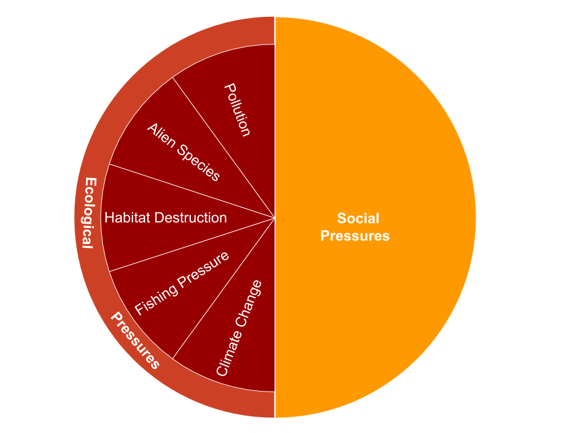
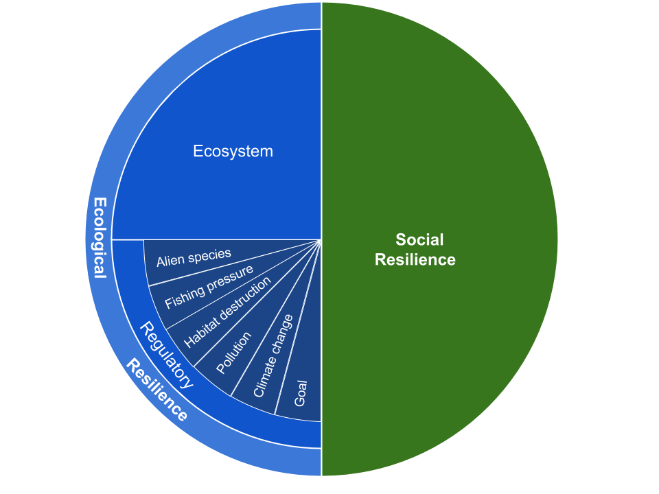

Compiled on `r date()`.

```{r setup, echo=FALSE, warning=FALSE, error=FALSE, message=FALSE}

library(knitr)
library(xtable)
library(pander)
library(dplyr)
library(tidyr)
library(ggplot2)
library(here)
library(tidyverse)

options(knitr.kable.NA = '')

```

***

# Ocean Health Index (OHI) Global Assessment

The Ocean Health Index (OHI) is a scientific framework used to measure how healthy oceans are. Understanding the state of our oceans is a first step towards ensuring they will continue to benefit humans now and in the future. The global Ocean Health Index was originally launched in 2012, with assessments conducted every year thereafter, to assess the condition of our global oceans.  The global assessment describes how well 220 countries (and some territorial regions) are sustainably managing 10 goals that represent the full suite of benefits people want and need from the ocean. These goals include: Artisanal Fishing Opportunity, Biodiversity, Carbon Storage, Clean Waters, coastal Livelihoods and Economies, Coastal Protection, Food Provision, Natural Products, Sense of Place, and Tourism and Recreation.  In addition to the global assessment, the OHI framework has been used to conduct assessments at smaller regional scales for over 36 countries and regions, referred to as OHI+ assessments. 

OHI assessments require the calculation of a score for each goal from 0 to 100, and the full suite of goal scores are then averaged to obtain an overall index score. Goal scores are calculated as the average of current status (current condition relative to a reference point) and likely future status.  Likely future status is the current status modified by the following dimensions: pressures predicted to reduce status (e.g., increasing SST, fishing pressures, invasive species);  resilience variables that mitigate pressures (e.g., effective fishing management, protected areas);  and recent trends in status.  For more information about the philosophy of the Ocean Health Index and model development see http://ohi-science.org.  

To assess the condition of Tetiaroa’s ocean resources, an OHI+ assessment was conducted as part of a collaboration between Tetiaroa Society’s 4site team and the University of California, Santa Barbara’s National Center for Ecological Analysis and Synthesis (NCEAS).  Here we report the conclusions from our analysis, and describe how we modified the goal models to reflect locally relevant management concerns. 

The tet-prep.html and tet-scores.html repositories contain all the data and scripts used to conduct the Tetiaroa assessment.  Future researchers can use this resource to build upon this assessment as better data become available and goal models evolve to better assess the status of this marine environment.Furthermore, the repository promotes transparent and open research, as well as more streamlined collaboration. (Stewart Lowndes et al. 2017)
https://www.nature.com/articles/s41559-017-0160.pdf?origin=ppub

<center>

</center>
<br>

***

## A description of Tetiaroa Atoll 

<center>

</center>
<br>

Tetiaroa Atoll is a group of 13 small islets (called motus) located 33 miles north of Tahiti. Originally settled over 4000 years ago, it served as a retreat for Tahitian royalty, until the arrival of British explorer James Cook in 1769. Despite falling under control of the British Crown for many years thereafter, it was regarded as sacred land by local people. Archaeological remains of temples and platforms can still be found on various motus. 

In the 1920s, much of the natural vegetation was removed to make way for coconut palm plantations, which remained active until the early 1960s. In 1967, Tetiaroa was purchased by American actor, filmmaker, and activist Marlon Brando, and remains under the ownership of his trust today. The waters around the island fall under the governance of French Polynesia. 

In 2014, a luxury eco-resort was established on one of the motus, Onetahi. Called The Brando, is it managed by luxury resort developer Pacific Beachcomber, LLC. The resort strives to be as sustainable as possible by minimizing visitors' impact on the natural environment and creating programs that showcase the ecology and culture of Polynesia. Revenue from the resort helps support The Tetiaroa Society, a non-profit that acts as the main environmental steward of the island, supporting visiting researchers, giving tours to resort guests, and spearheading conservation and restoration projects. 

The ecology of Tetiaroa is similar to other small islands in the South Pacific. The native flora and vegetation consists of coastal strand vegetation, which can be classified into four main assemblages: *Pisonia-Pandanus-Guettarda-Hernandia-Cordia* forests, *Suriana-Pemphis-Scaevola-Heliotropisum shurblands*, *Ipomea-Lepturus-Triumfetta-Vigna-Boerhavia* creeping vines and *Cladium-Marsicus-Elocharis-Fimbristyles* wetland sedges (CASUP). Much of the native land vegetation has been displaced by coconut palms, although some of the smaller motus remain almost completely covered by native habitat. In addition to preserving the undisturbed motus, it is also an eventual goal to re-introduce certain native endemic plants that were extirpated in the 1970s and 1980s.

Tetiaroa is surrounded by coral reefs and has additional reef structures in the lagoon, creating a highly productive and biodiverse marine environment. The reefs in Tetiaroa are relatively undisturbed due to the low number of people that live on or visit the island, and therefore environmental events such as coral bleaching, crown of thorns starfish outbreaks, and cyclones are currently the biggest threats to coral health. 


<br>


***

# Summary of the overall results

The health of Tetiaroa’s marine and coastal resources are critical to the mission of ensuring “island and coastal communities have a future as rich as their past - strengthening their resilience to global change, enhancing their ecosystem services, and preserving their culture” (https://www.tetiaroasociety.org/). Tetiaroa’s overall OHI score of 79 suggests that marine and coastal resources are supporting this goal fairly well. The goals with the highest scores are Iconic Species (91.73) and Tourism and Recreation (89.68). This suggests that many of the species with the most cultural and spiritual value to Tetiaroa are well protected, and efforts to implement sustainable tourism practices are successfully mitigating the impact of this activity on the island's environment. 

The only goal that scored below 50 was Conservation Economy. Tetiaroa's main environmental steward, The Tetiaroa Society, has been successful in generating funding and revenue to support conservation efforts on the island; however, more effort is needed to meet the continued need for resources to fund research and complete projects focusing on retoration and preservation of ocean health on Tetiaroa.


**Figure 2.1. OHI+ Tetiaroa Results** Each goal and sub-goal of the Tetiaroa Ocean Health Index assessment is represented by a petal. The length of each petal corresponds to the score (0-100), with longer petals indicating higher scores. The color of the petals also correspond to the scores with red indicating lower scores and blue indicating higher scores. The overall index score is shown in the center of the plot.
<br>   

**Table 2.1. Results for each goal and sub-goal in the Tetiaroa OHI+ assessment.** Goal, and sub-goal, scores, as well as current status and predicted future status. Where 'Status' is the current status relative to the reference point; 'Future' is the likely future status based on the trend, pressures, and resilience; and 'Score' is the final goal or sub-goal score reflected in Figure 3.1.  
<br>  
```{r score table, echo=FALSE,message=FALSE,warning=FALSE}
goals <- read_csv(here("region/conf/goals.csv")) %>%
  dplyr::select(goal, name, description)
scores <- read_csv(here("region/scores.csv")) %>%
  filter(dimension == "score" | dimension == "future" | dimension == "status") %>%
  dplyr::select(goal,dimension,score) %>%
  pivot_wider(id_cols ="goal", names_from = "dimension", values_from = "score") %>%
  filter(goal != "Index") %>%
  inner_join(.,goals, by = "goal") %>%
  dplyr::select(Goal = name, Status = status, Future = future, Score = score, Description = description) %>%
  arrange(desc(Score))


kable(scores, align = "l")
```


***

# Models: Methods and Results

```{r goal functions, echo=FALSE, warning=FALSE, error=FALSE, results="asis"}
## data and functions used to list data layers in each goal
# data with information
layers <- read.csv(here("/documents/methods-results/metadata_documentation/layers_tet_base.csv"))
targets <- read.csv(here("/documents/methods-results/metadata_documentation/layers_tet_targets.csv"))
#layers_web <- "http://ohi-science.org/ohi-global/layers.html"
# function
data_layers <- function(dimension, goal){  #goal = "ICO"; dimension=c("status", "trend")

  st <- targets[targets$goal == goal, ]
  st <- st[st$dimension %in% dimension, ]

st <- st %>%
  select(layer) %>%
  unique() 

st_layers <- filter(layers, layer %in% st$layer) %>%
  #mutate(web_name = gsub(" ", "_", name)) %>%
  #mutate(web_name = tolower(web_name)) %>%
  #mutate(web_name = gsub("/", "", web_name)) %>%
  mutate(info = sprintf("<u>%s</u> (%s): %s", name, layer, description))
cat(paste(st_layers$info, collapse="\n\n"))
}
```

## Goals Included in Tetiaroa OHI+ Assessment:

Given that Tetiaroa is a nearly uninhabited island, several of the OHI goals were not relevant to this region (e.g. Livelihoods and Economies).  Furthermore, one of the stated goals of The Tetiaroa society that the “island will serve as an ecological model… as well as a place for all manner of scientific research and investigation.” (https://www.tetiaroasociety.org/) which resulted in the creation of a new goal, Conservation Economy (CE). CE captures the revenue generated by the Tetiaroa Society to use for conservation and research purposes. Given these considerations, we modified the OHI framework to include the following goals (Table 3.1): Sense of Place (comprised of Lasting Special Places and Iconic species subgoals), Resource Access Opportunities (a modified version of Artisanal Opportunities in the original framework), Conservation Economy (a modified version of the Livelihoods and Economies goal), Tourism & Recreation, Biodiversity (comprised of Species Condition and Habitat subgoals), Clean Waters, Habitat Services (Coastal Protection and Carbon Storage subgoals).

The scope of this assessment encompasses all marine areas within a 3 nautical mile-buffer of the motus, as well as all the land that makes up the motus.

### Biodiversity (BD) 

<span style="color: #f2cf4a; font-family: Arial, sans-serif; font-size: large;">Score = 76.69</span>

The Biodiversity (BD) goal is made up of two subgoals, Habitats (HAB) and Species (SPP).


#### Habitats (HAB)

<span style="color: #f2cf4a; font-family: Arial, sans-serif; font-size: large;">Score = 70.09</span>

The habitat subgoal measures the average condition of marine habitats that provide critical habitat for a broad range of species (mangroves, coral reefs, seagrass beds, salt marshes, sea ice edge, and subtidal soft bottom). This subgoal is considered a proxy for the condition of the broad suite of marine species. For this subgoal, we include the native vegetation of the motus and coral reef habitats.

##### Current Status

The status of the habitat sub-goal, $x_{hab}$, was assessed as the average of the condition estimates, C, for each habitat, k, present in a region; measured as the loss of habitat and/or % degradation of remaining habitat, such that:

$$
x_{hab}= \frac { \displaystyle\sum _{ i=1 }^{ N }{ { (C }_{ k } }) }{N},(Eq.3.1)
$$

where, $C_k$ = $C_{c}/C_r$ and N is the number of habitats in a region. $C_c$ is the current condition and $C_r$ is the reference condition specific to each k habitat present in the region (Table 3.1).

**Table 3.1.** Description of condition, extent, and trend calculations for habitat data (Note: extent is not used to calculate the habitat subgoal, but is used for the coastal protection and carbon storage goals). More information about the sources used to generate these values is located in Section 6 and Table 6.1.

| Habitat | Condition | Extent | Trend |
| :----- | :-----------------| :------------ | :--------- |
| Native land vegetation | Scored based on relative area of coconut palms, native forest, and landscaped area (see below) | Estimates from the Tetiaroa Society | No trend
| Coral reef | Used global OHI score for French Polynesia | Total extent of coral reef within 3 nm of Tetiaroa | Used global trend for French Polynesia

**Land Habitat** 

Native plant species provide several benefits to the island (Table 3.2). A long term goal of Tetiaroa is to remove abandoned coconut plantations to restore the island to its ideal state with native plant species dominating.  Furthermore, given the small size of the motus, there is a tight link between the land and the ocean.  For these reasons, we included native land vegetation in our analysis.   The condition of native land habitat is estimated for several areas based on the extent of native habitat relative to coconut plantations and other altered land (i.e., landscaped areas), since much of the habitat on Onetahi has been altered for construction of the Brando. 

They Tetiaroa Society used Google Earth to estimate the area of coconut grove, mixed coconut grove and native habitat, and native habitat. They also estimated the area of landscaped habitat on Onetahi (Table 3.2). We assigned scores to each area based on the relative dominance of each land cover category (Table 3.3). The final score was calculated by taking an area weighted average of the area scores. Note: if the tree is designated on the Tetiaroa website as 'Polynesian Introduction' we still consider it native.

**Table 3.2. Dominant plant species based on plot surveys** 

| Motu | Dominant species | Native? | Notes |
| :----- | :--------- | :----- | :-------------------|
| Reiono | Pisonia grandis / Cabbage tree | yes | Important nesting site, helps protect against storm surge |
| Tiaraunu N | Cocos nucifera / Coconut palm | no | Coco plantations have made motus more vulnerable to storm surge and coastal erosion
| Tiaraunu S | Callophyllum inophyllum / Tamanu | yes | Introduced by native Polynesians, oil from its fruit used for many purposes |
| Rimatu | Pandanus tectorius / Screwpine | yes | Key food staple for native atoll inhabitants, used also for medicinal purposes and weaving | 
| Onetahi | Casuarina equisetifoilia / Ironwood | yes | Introduced by native Polynesians, can grow to 100 ft tall, symbol of the war god 'Oro |
| A'ie | Mixed forest | yes | No further details |

Although landscaped areas are most likely to replace native habitat, we know from The Brando's website that only native plants are used as an attempt to recreate the ecosystem. We therefore score these areas slightly better than "only coconut grove". Each area estimated by The Tetiaroa Society was assigned a score (Table 3.3), and then an area weighted average of the scores was used to calculate the overall score

**Table 3.3. Scores for different vegetation types on Tetiaroa**  

| Vegetation Type | Score |
| :--------------- | :------------ |
| Only native vegetation | 1 |
| Native vegetation mixed with coconut grove | 0.5 |
| Landscaped area | 0.3 |
| Only coconut grove | 0 | 


The condition of the native land habitat was calculated by finding the weighted average of the scored land cover categories (Eq 1.2). 

$$
C_{land} = \frac { \displaystyle\sum _{ i=1 }^{ N }{ { (S }_{ i } } \times { A }_{ i }) }{ { { A } }  }, (Eq. 3.2) 
$$  
For every $i$ vegetation type, we multiplied the score $S_{i}$ from Table X.X, by the area $A_{i}$ of that vegetation type on Tetiaroa. These were divided by the total area $A$ to find the overall native land habitat condition. 

**Marine Habitat** 

As no previous studies exist to estimate the condition of Tetiaroa’s coral, an estimate of coral health was derived using data from the 2019 OHI Global Assessment. More information on the coral health method can be found in the [OHI Global Methods](http://htmlpreview.github.io/?https://github.com/OHI-Science/ohi-global/published/documents/methods/Supplement.html#62_biodiversity) documentation, Section 6.2.1. No coral health was available for Tetiaroa in the OHI Global Assessment, so we used coral health score for French Polynesia as a proxy.

##### Trend

The Tetiaroa Society does not feel that the land vegetation makeup has had significant change over the past 5 years, therefore the trend for land habitats was zero. For coral reefs, we substituted the 2020 global trend score for French Polynesia. For coral reefs, we substituted the 2020 global trend score for French Polynesia. The OHI global trend data estimates change in coral condition during a 5 year period based on slope estimates from a linear regression model applied to coral condition in each country from1975-2006. More information on the coral trend method can be found in the [OHI Global Methods](http://htmlpreview.github.io/?https://github.com/OHI-Science/ohi-global/published/documents/methods/Supplement.html#62_biodiversity) documentation, Section 6.2.1.  

##### Data
_Status and trend_

```{r HAB data st, results="asis", echo=FALSE}
data_layers(goal="HAB", dimension=c("status", "trend"))
```

_Pressure_

```{r HAB data p, results="asis", echo=FALSE}
data_layers(goal="HAB", dimension=c("pressure"))
```

_Resilience_

```{r HAB r, results="asis", echo=FALSE}
data_layers(goal="HAB", dimension=c("resilience"))
```


#### Species (SPP) 

<span style="color: #f2cf4a; font-family: Arial, sans-serif; font-size: large;">Score = 83.29</span>

This subgoal aims to assess the average condition of the marine species within Tetiaroa based on their IUCN status. 

##### Current Status

Species status was calculated as the average of assessed species for Tetiaroa. Marine species distribution and threat category data mostly came from IUCN Red List of Threatened Species [http://www.iucnredlist.org](http://www.iucnredlist.org). Seabird distribution data came from Birdlife International [http://datazone.birdlife.org](http://datazone.birdlife.org).   

The reference point for the Species sub-goal is all species have an IUCN status of "Least Concern".  

We scaled the lower end of the biodiversity goal to be 0 when 75% species are extinct, a level comparable to the five documented mass extinctions (Barnosky *et al.* 2011)and would constitute a catastrophic loss of biodiversity. 

Conservation status scores, $w_{i}$, were assigned based on the IUCN threat categories status of each $i$ species, following the weighting schemes developed by Butchart *et al* (2007)  (Table 3.4). For the purposes of this analysis, we included only data for extant species for which sufficient data were available to conduct an assessment. We did not include Data Deficient species. We assessed species following previously published guidelines.

The species fall within 10 taxonomic classes and to avoid overweighting species with many species, status was first calculated for each class as the average of the extinction risk scores (Eq. 3.3). An overall extinction risk status was estimated by averaging the extinction risk score of all 10 classes (Eq. 3.4).


$$
\bar R_{class} = \frac { \displaystyle\sum _{ i=1 }^{ C }{ { w }_{ i } }  }{ { { N }_{c} }  }, (Eq. 3.3) 
$$
$$
\bar R_{spp} = \frac { \displaystyle\sum _{ i=1 }^{ N }{ { \bar R }_{ class } }  }{ { { N } }  }, (Eq. 3.4) 
$$
Where $C$ is the taxonomic class, $N_c$ are the total number of classes, $w$ is the conservation status, and $N$ is the total number of species. 

To convert $\bar R_{spp}$ into a score, we set a floor at 25% (representing a catastrophic loss of biodiversity, as noted above) and then rescaled to produce a $x_{spp}$ value between zero and one.

$$
x_{spp} = max \left( \frac { \bar R_{SPP} - .25 }{ .75 }, 0 \right), (Eq. 3.5)
$$


**Table 3.4. Conservation status for assessment of species status based on IUCN risk categories**

| Risk Category   | IUCN code | Conservation Status |
|-----------------|-----------|-------|
| Extinct         |     EX    |  0.0  |
| Critically Endangered | CR  |  0.2  |
| Endangered      |     EN    |  0.4  |
| Vulnerable      |     VU    |  0.6  |
| Near Threatened |     NT    |  0.8  |
| Least Concern   |     LC    |  1.0  |


##### Trend

The species trend is calculated using data the IUCN provides for current and past assessments of species. Discrete species assessments between 1965-2020 are used to estimate annual change in IUCN risk status for each species. Species trend is evaluated for species with more than two past assessments. Trend for species with less than two past assessments is estimated using the population trend noted in species history information. We then summarize these species trend values for each region using the same general approach used to calculate status.

##### Data
_Status and trend_

```{r SPP data st, results="asis", echo=FALSE}
data_layers(goal="SPP", dimension=c("status", "trend"))
```

_Pressure_

```{r SPP data p, results="asis", echo=FALSE}
data_layers(goal="SPP", dimension=c("pressure"))
```

_Resilience_

```{r SPP r, results="asis", echo=FALSE}
data_layers(goal="SPP", dimension=c("resilience"))
```


### Habitat Services (HS)

The Habitat Services (HS) goal measures additional services provided by habitats on Tetiaroa in addition to supporting biodiversity. The Habitat Services goal is made up of two equally weighted sub-goals, Coastal Protection (CP) and Carbon Storage (CS). However, due to a lack of data to quantify it, Carbon Storage is included only as a placeholder.
<br>   

#### Coastal Protection (CP) 

<span style="color: #f2cf4a; font-family: Arial, sans-serif; font-size: large;">Score = 84.92</span>

This subgoal assesses the amount of protection provided by marine and coastal habitats to coastal areas that people value, both inhabited (homes and other structures) and uninhabited (parks, special places, etc.). On Tetiaroa, both the coral reefs and native forest provide protection against storm surge from cyclones, flooding, and sea level rise. 

For an estimate of the extent of coral reefs, we used data from the Living Oceans Foundation French Polynesia report which was a product of . their 5-year Global Reef Expedition.  The objective of this undertaking was to survey and map the health and resilience of global reefs. The GRE mapped the benthic habitats of the Society Islands in 2012, including Tetiaroa, with the final report published in 2017. 

For an estimate of extent of native land habitat, we used area estimations of each habitat type derived by the Tetiaroa Society. 

##### Current Status 

The Coastal Protection current status is calculated as the current condition of coastal protection habitat relative to the reference point.

The status of this goal, $x_{cp}$, was calculated to be a function of the relative health of the habitats, $k$, weighted by their area and protectiveness rank (Table 5.4), such that:

$$
x_{cp} = \frac { \displaystyle\sum _{ k=1 }^{ N }{ { (h }_{ k } } \times { w }_{ k }\times { A }_{ k }) }{ \displaystyle\sum _{ k=1 }^{ N }{ { (w }_{ k }\times { A }_{ k }) }  }, (Eq. 3.6)
$$

where, $w$ is the rank weight of the habitat’s protective ability, $A$ is the area within a region for each $k$ habitat type, and $h$ is a measure of each habitat's condition:

$$
h = \frac { C_{ c } }{ { C }_{ r } }
$$

where, $C_c$ is current condition and $C_r$ is reference condition. Descriptions for how $C_c$ was calculated for both land and marine habitats are outlined above in the Biodiversity: Habitats sub-goal (4.1.1.1.1).

The native land habitat extent was calculated using Frank's area estimations of each habitat type on the motus. The extent of the coral habitat was defined as the total area of benthic habitat with reef structure, using estimations from the 2012 LOF expedition (Table 3.5). We considered any habitat classification with "reef" or "coral" as evidence of reef, and summed these areas for total reef extent.

**Table 1.5. Total area (km^2^) of benthic habitat types in Tetiaroa** Modified from table on page 21 of the LOF French Polynesia Final Report (CITE).
```{r lof_table, echo=FALSE}
lof_table <- read.csv(here("documents/methods-results/metadata_documentation/fp_habtable_clean.csv"), na.strings="") %>% 
  dplyr::select(Habitat = habitat, Classification = classification, Area = Tetiaroa) %>% 
  filter(!is.na(Habitat)) %>% 
  filter(str_detect(Classification, pattern = "coral") | str_detect(Classification, pattern = "reef"))

kable(lof_table, align = "l")
```

The reference area for each habitat is treated as a fixed value; in cases where current area might exceed this reference value (e.g., through restoration), we cap the score at the maximum value (1.0). Although this does not give credit for restoration, data tend to be of poor quality making it difficult to determine true increases, and in general habitat restoration beyond reference values is extremely unlikely. Rank weights for the protective ability of each habitat for the Global OHI ($w_{k}$) come from previous work (Tallis *et al* 2011). Although this work does not include native atoll forest as a category, we ranked it equal to mangroves or salt marshes given they occupy similar shoreline regions.

**Table 1.6. Coastal protectiveness ranks**
Scores range from 1-4, with 4 being the most protective (Tallis *et al* 2011).

Habitat | Protectiveness rank ($w$)
------- | -------------------------
Native land vegetation | 4
Coral reefs | 3 


#### Trend

The trend for this goal used the same metrics used for the Biodiversity: Habitats  subgoal trend. For native land habitat, we assumed a 0 trend as the vegetation make up on Tetiaroa's motus has not changed over the past 5 years. For coral reefs, we used the same data and approach used to calculate the coral condition trend for the Biodiversity: Habitats sub-goal. 

The Coastal Protection trend will uses the same data and approach used to calculate as the coral condition trend calculated for the Biodiversity: Habitats sub-goal

##### Data
_Status and trend_

```{r CP data st, results="asis", echo=FALSE}
data_layers(goal="CP", dimension=c("status", "trend"))
```

_Pressure_

```{r CP data p, results="asis", echo=FALSE}
data_layers(goal="CP", dimension=c("pressure"))
```

_Resilience_

```{r CP r, results="asis", echo=FALSE}
data_layers(goal="CP", dimension=c("resilience"))
```

#### Carbon Storage (CS)

The Carbon Storage goal measures the health of carbon storing habitats. Highly productive coastal wetland ecosystems (e.g., mangroves, salt marshes, seagrass beds) have substantially larger areal carbon burial rates than terrestrial forests, and "Blue Carbon" has been suggested as an alternate, more manageable carbon sequestration approach. The rapid destruction of these coastal habitats may release large amounts of buried carbon back into the ocean-atmosphere system. Our focus here, therefore, is on coastal habitats because they have large amounts of stored carbon that would rapidly be released with further habitat destruction and have the highest per-area sequestration rates of any habitat on the planet.  Although they are threatened, these habitats are amenable to management, conservation, and restoration efforts. We refer to this goal as carbon storage but intend its meaning to include sequestration.

Lacking data on the carbon storage abilities of the native rainforest, or of any other areas on Tetiaroa, we only included this goal as a placeholder for now. However, if future data on carbon storage becomes available, this goal can be updated. 

### Conservation Economy (CE)

<span style="color: #f2cf4a; font-family: Arial, sans-serif; font-size: large;">Score = 47.07</span>

The global OHI includes a measure of the jobs and revenue produced from marine-related industries, called the Livelihoods and Economies (LE) goal. Marine-related industries are clearly of huge value to many people, even those who do not directly participate in the industries but value community identity, tax revenue, and indirect economic and social impacts of a stable coastal economy. This goal is composed of two equally important sub-goals, livelihoods and economies, which are assessed across as many marine-related sectors as possible. Livelihoods assesses  the number of jobs and average annual wages. Economies is composed of a single component, revenue.

For Tetiaroa, we modified this model to capture the revenue generated by the Tetiaroa Society, and renamed the goal,  Conservation Economy (CE), to better reflect our objectives. We excluded the other metrics of Livelihoods and Economies because there are very few full time residents on the island, and all of them are employed by The Brando or the Tetiaroa Society. Nearly all of the Tetiaroa Society's activities and expenditures are related to environmental and cultural conservation of the island. Because a portion of the Tetiaroa Society's income comes from guest fees at the resort, there is a direct link between a healthy ocean or island environment that attracts tourism, and generating the funds necessary to help preserve it. 

We used the Tetiaroa's Society fundraising goal as the reference point, which breaks down as follows:

**Table 1.7. Ideal yearly budget for Tetiaroa Society Operations**

| Item | Yearly Cost | Description | 
| :------- | :--------: | :------------ |
| Operations | $700 K | Covers core staff and facilities maintenance / depreciation | 
| **Mission Programs:** |       |          |
| Conservation & Sustainable Use Plan | $ 250 K 
| Social-Ecological System Observatory | $750 K | Monitoring CASUP, data management, and establishing baselines for science |
| Science Programs | $100 K | Seed grants, equipment, meetings, workshops |
| Cultural and Educational Programs | $100 K |       |
| Blue Climate Initiative | $100 K |       |

**Total Yearly Budget Goal** = $2,000,000 

To measure the status of this goal, we used the 2018 and 2019 Tetiaroa Society income reports and $700,000 as the income for 2020 (per the Tetiaroa Society). The current status was calculated by dividing the actual income by the yearly budget goal.

$$
status_{ce}~=~ \frac { I_{yr}} { I_{ref} },  ~~(Eq ~3.7)
$$  

Where $I_{yr}$ is the yearly income, and $I_{yr,ref}$ is the yearly budget goal.  

##### Trend

The trend for this goal was calculated using only  three years of available data, rather than the usual five.

##### Data
_Status and trend_

```{r CE data st, results="asis", echo=FALSE}
data_layers(goal="CE", dimension=c("status", "trend"))
```

_Pressure_

```{r CE data p, results="asis", echo=FALSE}
data_layers(goal="CE", dimension=c("pressure"))
```

_Resilience_

```{r CE r, results="asis", echo=FALSE}
data_layers(goal="CE", dimension=c("resilience"))
```


### Sense of Place (SP) 

<span style="color: #f2cf4a; font-family: Arial, sans-serif; font-size: large;">Score = 84.41</span>

The Sense of Place (SP) goal attempts to capture the aspects of Tetiaroa's coastal and marine system that people value as part of their cultural identity. This definition includes people living near the ocean and those who live far from it but still derive a sense of identity or value from knowing particular places or species exist. While there are only a small handful of residents on Tetiaroa, the island's pristine ecosystems are valued by scientists, researchers, and conservationists, among others, including the general public. This goal is calculated using two equally weighted subgoals: iconic species (ICO) and lasting special places (LSP).

#### Iconic Species (ICO) 

<span style="color: #f2cf4a; font-family: Arial, sans-serif; font-size: large;">Score = 90.02</span>

Iconic species are those that are relevant to local cultural identity through their relationship to one or more of the following: 1) traditional activities such as fishing, hunting or commerce; 2) local ethnic or religious practices; 3) existence value; and 4) locally-recognized aesthetic value (e.g., tourist attractions/common subjects for art such as whales). Ultimately, almost any species can be iconic to someone, and so the intent with this goal was to focus on those species widely seen as iconic from a cultural or existence value (rather than a livelihood or extractive reason). Habitat-forming species were not included, nor were species harvested solely for economic or utilitarian purposes (even though they may be iconic to a sector or individual).

The Iconic Species subgoal assesses the conservation status of species that have particular value to Tetiaroa. A primary iconic species list  for Tetiaroa was gathered based on species listed on the [Tetiaroa Society’s website](https://www.tetiaroasociety.org/index.php/island).


##### Current Status 

After compiling a list of species from this source, conservation statuses were obtained using the RRedlist package and each species was assigned a score based on its conservation status (Table 1.7). 

**Table 3.8. Weights for assessment of species status based on IUCN risk categories**

| Risk Category   | IUCN code | Weight|
|-----------------|-----------|-------|
| Extinct         |     EX    |  0.0  |
| Critically Endangered | CR  |  0.2  |
| Endangered      |     EN    |  0.4  |
| Vulnerable      |     VU    |  0.6  |
| Near Threatened |     NT    |  0.8  |
| Least Concern   |     LC    |  1.0  |

The reference point is 100% of species have a status of "Least Concern". The overall score is determined by finding the average score per species class, and then taking the overall average among the classes, as done in the Biodiversity: species sub-goal (see Eq. 3.3, Eq. 3.4 and Eq 3.5). 

##### Trend 

We calculated trend using data the IUCN provides for current and past assessments of species, which we used to create a time series of average risk status for species within Tetiaroa. Because IUCN assessments are generally infrequent for any given species, we derive the trend as the annual change in risk status for each species across the previous twenty years, rather than a five-year window typical of other goals, and include only taxa with two or more IUCN assessments within the past 20 years.

##### Data
_Status and trend_

```{r ICO data st, results="asis", echo=FALSE}
data_layers(goal="ICO", dimension=c("status", "trend"))
```

_Pressure_

```{r ICO data p, results="asis", echo=FALSE}
data_layers(goal="ICO", dimension=c("pressure"))
```

_Resilience_

```{r ICO r, results="asis", echo=FALSE}
data_layers(goal="ICO", dimension=c("resilience"))
```


#### Lasting Special Places (LSP)

<span style="color: #f2cf4a; font-family: Arial, sans-serif; font-size: large;">Score = 78.80</span>

The lasting special places subgoal focuses on geographic locations that hold particular value for aesthetic, spiritual, cultural, recreational or existence reasons (TRC 2004). For this subgoal, we assume areas that are protected indicate special places (i.e., the effort to protect them suggests they are important places). Clearly this is an imperfect assumption but in many cases it will be true. The model for this goal equally weights protected areas located in the inland coastal zone (up to 1 km inland) and the offshore coastal zone (up to 3 nm offshore).  The status for this goal is calculated as:  

<br>


$$X_{LSP} = \frac{\left(\frac{Area_{P}}{Area_{P_{ref}}} + \frac{Area_{MPA}}{Area_{MPA_{ref}}}\right)}{2} ~~(Eq ~3.8)$$ 

where: 

* $Area_{P}$ = Protected area for inland 1 km buffer
* ${Area_{P_{ref}}}$ = Reference value for inland protected area
* $Area_{MPA}$ = Marine protected area for offshore 3 nm buffer
* ${Area_{MPA_{ref}}}$ = Reference value for marine protected area within offshore 3 nm buffer
* $Ref$ = 30% of total area within buffer zone is protected
  
    
<br>

We used the methods above to assess protected areas in order to create a resilience layer (see X.X). Creating more protected areas is not currently a primary goal of the Tetiaroa Society, however improving management of currently protected areas and increasing participation of diverse stakeholders is. To reflect this objective, we split Tetiaroa’s area into zones based on management schemes: the land area, the no take zone which occupies half the lagoon, the rest of the lagoon, and the area extending outwards 3nm from each motu ("offshore"). 

We computed a score for each zone based on if they meet four criteria considered important for successful management,  (Table 1.8), developed through conversations with Frank Murphy and Neil Davies: 

1. Is there more than one stakeholder?
2. Is there a management plan for that area in place?
3. Does there exist some sort of monitoring or tracking of the effects of the management plan?
4. Has the management plan been effective in changing behaviors or meeting its objectives?


**Table 3.9. Criteria for effective management of Tetiaroa** A score of 1 indicates the criteria is fulfilled to the best extent and 0 indicates the criteria does not exist.

| Zone | Multiple Stakeholders | Plan | Monitoring | Effectiveness |
| :---- | :----------- | :------- | :------- | :------- |
| All motus | 1 | 1 | 1 | 1 |
| No-take zone | 1 | 1 | 1 | 0.75 |
| Rest of Lagoon | 1 | 1 | 1 | 1 |
| 3nm offshore | 0 | 0.5 | 0 | 0 | 1 |

**Motus**

The land in Tetiaroa is privately owned by Marlon Brando's trust, which has a 99-year simple fee lease. Brando always wanted Tetiaroa to be preserved as an ecological sanctuary, and helped create The Tetiaroa society to manage all conservation activities on the island. The Tetiaroa Society has worked with the trust, the government, and The Brando resort to create management plans for all motus. These areas meet all four criteria.

**Lagoon No-Take Zone**. 

Half the lagoon is considered a protected "no-take zone", which is enforced by rangers employed with the Tetiaroa Society. According to the Tetiaroa Society's [sustainable use plan](https://www.tetiaroasociety.org/sites/default/files/research-docs/Tetiaroa-CASUP.pdf), this area is recognized by the Ministry for Natural Resources as of June 2014. However, Frank and Neil pointed out that while there are rangers employed, the monitoring effort has not helped to determine how well this area is deterring fisherman or other ecologically damaging activities. Therefore, it meets the first three criteria and scores a 0.75.  

**Rest of the lagoon**

The Tetiaroa Society and The Brando are involved in the management of the rest of the lagoon, so we consider this area to have multiple stakeholders. There is also a plan, with enforced seasonal fishing restrictions. Frank feels this enforcement is effective, more so than the no-take zone. This zone therefore meets 4 out of 4 criteria.

**Offshore**

The marine area 3 nm offshore from Tetiaroa is managed solely by the French Polynesian Government. Although there are restrictions on fishing in all French Polynesian waters (i.e. year-round prohibitions on shark fishing),  a comprehensive management plan for pelagic ecosystems does not exist, so we score this criteria as 0.5. Because the existing "management plan" is very simple, Frank and Neil feel it is well enforced, even if it is not monitored well. This might seem counterintuitive, but it may be that fishers and visitors are adhering to the restrictions largely because violation can result in large fines and possible jail time, acting a strong deterrent despite a lack of monitoring.

##### Current status 

The status score was calculated as the average of the land, lagoon and offshore scores. The land score was calculated using the weighted average of each motu's score, weighted by area, which leaves room for the score of a specific motu to change if future monitoring finds that the management plans have not been effective in deterring poachers, preventing introductions of non-native species, or managing other issues.

$$
status_{land} = \frac { \displaystyle\sum _{ k=1 }^{ N }{ { (s }_{ m } } \times { A }_{ m }) }{ \displaystyle\sum _{ k=1 }^{ N }{ { A }_{ m } }  }, (Eq. 3.9)
$$  

Where $s_{m}$ is the score for each motu and $A_{m}$ is the area of that motu, divided by the total area to get a weighted average. 

The status for all zones (land, no-take zone, lagoon and offshore) were averaged to find the overall status. 


##### Trend


The management scheme for these zones have not changed since 2014, when The Brando opened. Therefore, the trend for this score is zero. 
 

##### Data
_Status and trend_

```{r LSP data st, results="asis", echo=FALSE}
data_layers(goal="LSP", dimension=c("status", "trend"))
```

_Pressure_

```{r LSP data p, results="asis", echo=FALSE}
data_layers(goal="LSP", dimension=c("pressure"))
```

_Resilience_

```{r LSP r, results="asis", echo=FALSE}
data_layers(goal="LSP", dimension=c("resilience"))
```


### Tourism and Recreation (TR)

<span style="color: #f2cf4a; font-family: Arial, sans-serif; font-size: large;">Score = 89.68</span>

For the goal, the score assesses the progress towards  sustainability of [The Brando](https://thebrando.com/) resort, the eco-resort on Onetahi. 

For this goal, we used sustainability datafrom [SA Beachcomber's 2019 sustainability report](https://en.calameo.com/read/004500545654d0392cc93). We did requestt actual data from The Brando, contacting the sustainability manager, Alban Perret. He was not able to share any data at this time, as The Brando has had to push their sustainability work to 2021. Alban said to reach out again in Q2 2021 for an update.

The Brando has already achieved far more in terms of sustainability than most resorts, so setting a reference point is tricky. They were the first resort building to receive LEED Platinum certification, and already have a very low impact. We assume a reference point of 100% sustainability, i.e. have zero footprint. The 2019 sustainability report outlines the following broad goal, which supports this reference point: 

>"Decrease carbon footprint of human activity on the island, working towards zero impact"


There are a handful of green / eco / sustainable tourism certifications, but one that provides a helpful framework is the [Green Destinations](https://greendestinations.org/green-destinations-standard/) certification. This certification has 100 criteria, from which we identified 3 categories under the "Environment and Climate" to group the statistics from the sustainability report:

* Energy use
* Waste & Recycling
* Water management


##### Current Status

We scored each sustainability category based on two criteria: 

1. How close it is to 100% sustainable, or zero impact?
2. Is progress  closely monitored?

If the answer to the second criteria is "no", the score was reduced by 0.5.

Based on our limited information, we believe that energy and waste meet both these criteria, while water does not. Furthermore, the amount of water sourced from non-native freshwater is unclear, making it difficult to score this category. If a category includes multiple metrics, they were averaged to get the category score. We then averaged the three category scores to get the final score.


$$
status_{tr} = \frac { \displaystyle\sum _{ k=1 }^{ N }{ { (S }_{ c} } \times { M }) }{ \displaystyle\sum _{ k=1 }^{ N }{ { c } }  }, (Eq. 4.0)
$$  

Where $S_{c}$ is the percent of each sustainability category that is "zero impact", $M_{c}$ is whether or not it is being monitored, and $c$ are the number of categories included in the score. 

##### Trend

Since we only have the Sustainability Report for 2019, we do not know how these measures have changed since 2014 (when the resort opened). For now, we use a  trend of zero, that can be updated with improved data. 

##### Data
_Status and trend_

```{r TR data st, results="asis", echo=FALSE}
data_layers(goal="TR", dimension=c("status", "trend"))
```

_Pressure_

```{r TR data p, results="asis", echo=FALSE}
data_layers(goal="TR", dimension=c("pressure"))
```

_Resilience_

```{r TR r, results="asis", echo=FALSE}
data_layers(goal="TR", dimension=c("resilience"))
```


### Clean Waters (CW)

People value marine waters that are free of pollution and debris for aesthetic and health reasons. Contamination of waters comes from sources such as oil spills, agriculture, sewage, land-based runoff, and trash from human activities.. People are sensitive to water pollution  in areas they access for recreation or other purposes, and generally value the existence of clean waters. This goal scores highest when the contamination level is zero.

There are currently no publically available data from comprehensive studies on water contamination on Tetiaroa. Therefore, while this goal is relevant to Ocean Health on Tetiaroa, it is only included as a placeholder to be updated as data becomes available.

### Resource Access Opportunities (RAO)

People value the ability to access coastal and ocean resources. Isolating what allows for this type of access is difficult, but a necessary component of humans' relationship with the ocean. This goal would be useful to Tetiaroa, as both tourists and local fisherman from other areas of French Polynesia value the ability to access Tetiaroa for various uses. Lacking quantitative data to measure current status, as well as an agreed upon reference point, we have included this goal as a placeholder for now.

### Food Provision (FP)

The Food Provision (FP) goal is made up of two subgoals, Fisheries (FIS) and Mariculture (MAR).

One of the most fundamental services the ocean provides people is the provision of seafood. The Food Provision goal measures the amount of seafood sustainably harvested within an EEZ or region through any means for human consumption and thus includes wild-caught commercial fisheries, mariculture, and artisanal-scale fisheries. 

The Food Provision goal was not included in this assessment because the number of people that live on Tetiaroa full time is very small, and they do not rely directly on the surrounding waters for food. While there is some fishing (recreational and artisanal), it is not a management goal of the Tetiaroa Society to increase fishing activity and / or develop new fishing opportunities in these waters. Therefore, we did not feel it would be useful to include this goal.  


### Artisanal Fishing Opportunity (AO)

Artisanal fishing, often also called small-scale fishing, provides a critical source of food, nutrition, poverty alleviation, and livelihood opportunities for many people around the world, in particular in developing nations (Allison & Ellis 2001). Artisanal fishing refers to fisheries involving households, cooperatives, or small firms (as opposed to large, commercial companies) that use relatively small amounts of capital and energy and small fishing vessels (if any), make relatively short fishing trips, and use fish mainly for local consumption or trade. 

There are no small scale fishers based on Tetiaroa. Artisanal fishers from Tahiti or Moorea have access to Tetiaroa's waters, but it is not a goal of Tetiaroa's main stakeholders to increase artisanal fishing as a food source or industry in these waters. Therefore, this goal was not included in the assessment.

### Natural Products (NP)

In many countries the harvest of non-food natural products is important for local economies and can also be traded internationally. The sustainable harvest of these products is therefore an important component of a healthy ocean. This goal assesses the ability of countries to maximize the sustainable harvest of living marine resources, such as corals, shells, seaweeds, and fish for the aquarium trade. 

This type of harvesting of natural products for sale or trade does not occur on Tetiaroa and therefore is not included in this OHI+ assessment.   

### Livelihoods & Economies (LE)

The Livelihoods & Economies (LE) goal is made up of two subgoals, Livelihoods (LIV) and Economies (ECO). The Conservation Economy included in this assessment serves as a replacement for the Economies goal.

While The Brando and the Tetiaroa Society do provide livelihoods to a small number of people, it is not a goal to increase the number of jobs provided or expand the tourism industry in Tetiaroa. Rather, a long term goal is to create an ecological sanctuary and preserve the island from further development. It is a goal to create and generate revenue to help accomplish this vision, which is why we included the Conservation Economy goal, but left out the Livelihoods goal. 


***

## Pressures

The pressure score, $p$, describes the cumulative pressures acting on a goal which suppress the goal score.  Pressure scores range from 0 to 1, and they are calculated for each goal and region and include both ecological ($p_{E}$) and social pressures ($p_{S}$) (Table 5.1, Figure 5.1), such that:

$$
{ p }\quad =\quad \gamma *{ p }_{ E }\quad +\quad (1-\gamma )*{ p }_{ S }, (Eq. 4.6)
$$

where $\gamma$ is the relative weight for ecological vs. social pressures and equals 0.5 for the global assessment. At local or regional scales there may be clear evidence for unequal weights per goal and $\gamma$ should be adjusted accordingly.


**Figure 3.1. Pressure components**
Pressure is calculated using both social and ecological pressures.  Ecological pressures include 5 subcategories (fishing pressure, habitat destruction, climate change, water pollution, and species/genetic introductions).  



<br>
**Table 3.1. Pressure data and categories**
Description of the stressor data layers used to calculate overall pressure for each goal and region for the global assessment (descriptions of pressure data in section 6).  Each data layer is assigned to an ecological or social category, and ecological data are assigned to one of five subcategories. 

```{r pressure categories, echo = FALSE, warning=FALSE, message = FALSE, error =FALSE}

#table (global now)

full_lyr_names <- read.csv(here("documents/methods-results/metadata_documentation/layers_tet_base.csv")) %>%
  select(layer, name, description)
pressure_cat <- read.csv(here("region/conf/pressure_categories.csv")) %>%
  left_join(full_lyr_names, by = "layer") %>%
  mutate(subcategory = gsub("_", " ", subcategory)) %>%
  select(Data = name, "Short name" = layer, Category = category, Subcategory = subcategory, Description = description)
kable(pressure_cat, align = "l")


```

### Ecological Pressure

The global OHI includes five ecological pressure categories (Figure XX). For this assessment, we included four of broad, globally-relevant categories of ecological stressors: fishing pressure, climate change (including ocean acidification), water pollution, and species introductions (invasive species and genetic escapes). The four categories are intended to capture known pressures to the social-ecological system associated with each goal. More pressures can be added to Tetiaroa's assessment as data becomes more available. The intensity of each stressor within each OHI region is scaled from 0 to 1, with 1 indicating the highest stress (e.g., example of one of these data layers is [sea surface temperature](https://github.com/OHI-Science/ohi-global/blob/draft/eez/layers/cc_sst.csv)).

**Climate Change**

Four stressors are considered as climate change pressures: ocean acidification, sea level rise, sea surface temperature, and ultraviolet radiation. 

<u>Ocean Acidification</u> 
Ocean acidification pressure scores are found using the same methods as the OHI Global assessment. Additional information on how this data is processed to obtain 0-1 scores can be found [here](https://cdn.rawgit.com/OHI-Science/ohiprep/master/globalprep/prs_oa/v2017/create_oa_layer.html). The global data is cropped to a 3 nautical mile boundary around Palmyra.   

<u>Sea Level Rise</u> 
Sea level rise pressure scores are found using the same methods as the OHI Global assessment. Additional information on how this data is processed to obtain 0-1 scores can be found [here](https://ohi-science.org/ohiprep_v2019/globalprep/prs_slr/v2019/slr_layer_prep_v2.html). The global data is cropped to a 3 nautical mile boundary around Palmyra.  

<u>Sea Surface Temperature</u> 
Sea surface temperature pressure scores are found using the same methods as the OHI Global assessment. Additional information on how this data is processed to obtain 0-1 scores can be found [here](http://ohi-science.org/ohiprep_v2020/globalprep/prs_sst/v2018/sst_layer_prep.html). The global data is cropped to a 3 nautical mile boundary around Palmyra.  

<u>Ultraviolet Radiation</u> 
Ultraviolet radiation pressure scores are found using the same methods as the OHI Global assessment. Additional information on how this data is processed to obtain 0-1 scores can be found [here](http://ohi-science.org/ohiprep_v2020/globalprep/prs_uv/v2020/uv_dataprep.html). The global data is cropped to a 3 nautical mile boundary around Palmyra.

Data Sources:  

- Feely, R.A., S.C. Doney, and S.R. Cooley. 2009. Ocean acidification: Present conditions and future changes in a high-CO2 world. Oceanography 22(4):36–47   
- AVISO [Monthly mean Maps of Sea Level Anomaly](https://www.aviso.altimetry.fr/data/products/sea-surface-height-products/global/gridded-sea-level-anomalies-mean-and-climatology.html)   
- Saha, Korak; Zhao, Xuepeng; Zhang, Huai-min; Casey, Kenneth S.; Zhang, Dexin; Zhang, Yongsheng; Baker-Yeboah, Sheekela; Relph, John M.; Krishnan, Ajay; Ryan, Thomas (2018). The Coral Reef Temperature Anomaly Database (CoRTAD) Version 6 - Global, 4 km Sea Surface Temperature and Related Thermal Stress Metrics for 1982 to 2017. NOAA National Centers for Environmental Information. Dataset. https://doi.org/10.25921/ffw7-cs39. Accessed: July 23, 2020.   
- Jari Hovila, Antii Arola, and Johanna Tamminen (2014), OMI/Aura Surface UVB Irradiance and Erythemal Dose Daily L2 Global Gridded 0.25 degree x 0.25 degree V3, NASA Goddard Space Flight Center, Goddard Earth Sciences Data and Information Services Center (GES DISC), Accessed [June 22, 2020] DOI:10.5067/Aura/OMI/DATA2028.
<br> 

**Habitat Destruction**

Habitat destruction from various industries or overcrowding is a significant pressure on many coastal and intertidal environments. On Tetiaroa, this might result from tourists walking in sensitive, shallow intertidal areas, accidentally disturbing coral structures while snorkeling or boating, or participating in recreational fishing. A good way to quantify this goal might be using the number of people on the island at peak tourism (ie population density), with a reference point representing the maximum number of people that could sustainably visit the island at once. Jamie did something similar with OHI+ Northeast to represent beach trampling pressure. 

Lacking data, we added an empty layer that can be updated as data on visitor numbers and visitor activities becomes available and a realistic reference point can be calculated.

**Water Pollution**

Potential sources for water pollution on Tetiaroa include emissions from boats, trash from visitors or nearby areas, and runoff from any built environment on the island, including The Brando. For now, we use the inverse of the Waste Management score as the pollution pressure, which assumes that any waste not processed by The Brando is being emitted to the environment.

**Alien Species**

There are various invasive species on Tetiaroa, most of them terrestrial. For this pressure, we considered 5 that are the highest priority for eradication, which includes: 2 species of rat, ants, mosquitos, and biting flies. While there are projects in progress for all these species, full eradication has only occurred for rats on 2 of the motus. We scored each motu based on how many out of the 5 had been successfully eradicated, and then took the area weighted average of all motus for the final pressure score. 

### Social Pressures 

We also included one social pressure, which is the inverse of the Lasting Special Places goal score. The methods used to calculate Lasting Special Places were based on existing management strategies rather than just protected areas, and therefore we feel the inverse of the score captures how those strategies might be lacking for certain zones in Tetiaroa. 

We determined the rank sensitivity of each goal/subgoal to each stressor (or, when possible, an element of the goal, such as a specific habitat).  We ranked ecological pressures as having ‘high’ (score = 3), ‘medium’ (score = 2), ‘low’ (score = 1), or 'no' (score = NA) impact (Table 4.2). The pressure ranks are based on a rough estimate of the global average intensity and frequency of the stressor. We recognize that this will create over- and under-estimates for different places around the planet, but to address such variance in a meaningful way would require a separate weighting matrix for every single region on the planet, which is not feasible at this time.  

**Table 3.2. Pressure matrix**
Rank sensitivity of each goal (or, goal element) to each stressor.
```{r pressure matrix, echo = FALSE}

pressure_matrix <- read.csv(here("region/conf/pressures_matrix.csv"), na.strings=c("","NA"), stringsAsFactors = FALSE) %>%
  mutate(element = ifelse(is.na(element_name), element, element_name)) %>%
  select(-element_name) %>%
  gather("layer", "rank", -(1:2)) %>%
  spread(layer, rank, fill="") %>%
  mutate(element = gsub("_", " ", element))
kable(pressure_matrix, align = "l")


```

### Caveats 

A key assumption in our assessment of ecological pressures is that each goal has a linear and additive response to increases in intensity of the stressors. Clearly many ecosystems respond non-linearly to increased stressor intensity, exhibiting threshold responses, and there are likely nonlinear interactions among stressors. Unfortunately little is known about the nature of these types of nonlinearities and interactions so we could not include them in any meaningful way.  


***

## Resilience 

To calculate resilience for each goal and region, $r$, we assess three resilience categories (Table 4.3, Figure 4.3): ecological integrity, $Y_{E}$, regulatory efforts that address ecological pressures, $Y_R$, and social integrity, $Y_{S}$. The first two measures address ecological resilience while the third addresses social resilience. When all three aspects are relevant to a goal, resilience is calculated as:

$$
r\quad =\quad \gamma *(\frac { { Y }_{ E }+ {Y}_{R} }{ 2 } )+(1-\gamma )*{ Y }_{ S }, (Eq. 4.10)
$$

We chose $\gamma = 0.5$ so the weight of resilience components that address ecological systems (ecosystem and regulatory) vs. social systems would be equivalent to the proportions used in the model to calculate pressure. 

**Figure 3.2. Resilience components**
Resilience includes both ecological and social resilience categories.  Ecological resilience includes an ecosystem and regulatory category.  The regulatory category includes 5 subcategories that mirror the pressure categories (fishing pressure, habitat destruction, climate change, water pollution, and species/genetic introductions) as well as a goal-specific category.



Each resilience category is composed of 1 or more data layers (Table 4.3) with values scaled from 0-1, reflecting the magnitude of resilience, for each region (an example of one of these data layers describes [tourism regulations that preserve biodiversity](https://github.com/OHI-Science/ohi-global/blob/draft/eez/layers/g_tourism.csv)).  Each resilience data layer is assigned a weight of 0.5 or 1 (Table 4.3) that is applied equally across all the goals (or, goal elements) influenced by the resilience layer (i.e., resilience matrix, Table 4.4). This information is used to calculate a score for each resilience category. The weight reflects information about governance. 


**Table 3.3. Resilience categories and weights**
The data layers used to calculate resilience for each goal and region for the global assessment (descriptions of data layers and sources are in section 6).  Each data layer is assigned to an ecological or social category.  The ecological category is broken into an ecosystem and regulatory category type.
```{r Resilience categories and weight table, echo=FALSE, warning=FALSE, message=FALSE, error=FALSE}
full_lyr_names <- read.csv(here("documents/methods-results/metadata_documentation/layers_tet_base.csv")) %>% 
  select(layer, name)
res_cat <- read.csv(here("region/conf/resilience_categories.csv")) %>%
  left_join(full_lyr_names, by = "layer") %>%
  mutate(subcategory = gsub("_", " ", subcategory)) %>%
  select(Data = name, "Short name" = layer, Category = category, "Category type" = category_type, Subcategory = subcategory, Weight=weight)
kable(res_cat, align = "l")
```


**Table 2.3. Resilience matrix**
Describes which goals/subgoals (and goal elements) are influenced by the resilience data layers.
```{r Resilience matrix, echo=FALSE, warning=FALSE, error=FALSE, message=FALSE}
res_matrix <- read.csv(here("region/conf/resilience_matrix.csv"), na.strings="") 
kable(res_matrix, align = "l")
```

#### Ecological resilience

##### Ecosystem integrity

Ecosystem integrity, e.g., food web integrity, is measured as relative condition of assessed species in a given location (scores from the species subgoal were used to estimate ecosystem integrity). For some goals, there is little evidence that our index of ecosystem integrity directly affects the value of the goal (or subgoal).  In these instances, ecological integrity falls out of the resilience model.

Ecosystem integrity, as measured by species diversity, helps support multiple goals. Tetiaroa's Conservation Economy relies on both people valuing a healthy atoll ecosystem and wanting to come visit it. It also supports the health of iconic species that are culturally important on Tetiaroa. Ecosystem integrity also helps ensure that coral reefs and native vegetation habitat can sustain biodiversity. 

##### Regulatory resilience

Regulatory resilience describes the institutional measures (e.g., rules, regulations, and laws) designed to address ecological pressures. The regulatory resilience datasets are grouped into five categories that address the 5 pressure categories: fishing pressure, habitat destruction, climate change, water pollution, and alien species. For this assessment we use two resilience layers for each pressure category where possible: regulations and management.  

Regulation layers are based on if there are established rules to prevent ecological pressures. For alien species, we use the presence of rules to prevent the introduction and spread of invasive species from boats, vessels, and cargo. Fishing and habitat regulations are based on the establishment of protected areas. For fishing resilience, we use the presence of marine protected areas and for habitats, we consider both terrestrial protected areas and marine protected areas. Due to the lack of permanent residents, pollution and climate change don't have localized rules and therefore aren't considered as resilience layers.

Management layers are derived for climate change, habitats, fishing, and alien species based on evaluation of three questions:   
 1. Is there a management plan?    
 2. Does there exist some sort of monitoring or tracking of the effects of the management plan?   
 3. Has the management plan been effective in changing behaviors or meeting its objectives?   
 
A score of one is given for every "Yes" response, a zero given for a "No" response, and 0.5 given if management plans or monitoring programs are "In Development". The overall resilience layer score is the sum over three. Since the inverse of the habitat management resilience is used for a social pressure, we will consider this a social resilience instead of an ecological one.    

<u>Fishing Regulations:</u> French Polynesia has stringent fishing regulations on sharks, marine mammals, turtles, certain crustaceans and certain corals (Mariners Stopover Plan, 2020). Mirroring what was done for the Lasting Special Places goal, we gave this resilience score a 1 for the first criteria, a 0 for the second, and a 1 for the third. 

<u>Habitat resilience:</u> We included a measure of how much of Tetiaroa falls under a recognized protected area. Officially, this only includes the no-take zone established in the lagoon, as well as the land. For this protected area, The Tetiaroa Society has implemented a management plan with monitoring, but feel that it should be a 0.75 in its effectiveness. 

<u>Alien Species</u>: Tetiaroa has begun implementing a robust biosecurity plan in order to prevent more non-native species from being introduced to the island (cite). After reviewing this plan and the best biosecurity practices for small islands (Sherley, 2000), we score this regulation as 1 in the first criteria, a 1 in the second criteria, and a 0.5 in the last one since the full suite of preventative measures have yet to be implemented. 

### Social resilience

Social integrity is intended to describe those processes internal to a community that affect its resilience. It is a function of a wide range of aspects of social structure. Ideally, assessments of social resilience would include state and federal level rules and other relevant institutional mechanisms. For this assessment we consider social resilience to be based on general management of Tetiaroa's ecosystems, as well as how the extent to which local Polynesians are involved in the operations of the island. For management, we used a lack of management as a social pressure and will use the inverse of this score as our resilience layer. The management layer was derived using the same method as the Lasting Special Places layer. As a proxy for local knowledge, we used the percentage of the staff employed by the Brando that are local Polynesian's - however a better measure might include extent to which local Polynesians are involved in high level decision making and resource management on the island or have access to certain resources on Tetiaroa.   


***

## Weaknesses

This assessment relied on 19 different data sources to create the 36 data layers used to calculate each goal, pressure or resilience score. To highlight opportunities to improve the data used for future assessments, we evaluated all the data sources across three dimensions: spatial, temporal, and fit. Each data set is scored across the criteria listed below and given a 0.0 (poor), 0.5 (fair) or 1.0 (good as applicable). Full dimensions and methods are described in O'hara et al. 2020 and are loosely based upon methods in Fritz et al. (2019)

**Spatial Dimension** 

- Cover: Data focuses on the area of interest, which includes all motus on Tetiaroa, the lagoon, and the area extending 3 nautical miles offshore.Scored as 1.0 if data is specific to Tetiaroa, 0.5 if data from a neighboring state or island is used, and 0 if the data was global. 

**Temporal Dimension**

- Resolution: Temporal data are updated consistently throughout the time period. Habitat data (which include extent maps, health metrics) gets a 1.0 if it is updated every 3-5 years, a 0.5 if it is updated in the last 10 years or earlier, and 0 if we only have static data spanning one year. The rest of the data gets 1.0 if it is updated annually, a 0.5 if it is updated within the last 5 years, and 0 if it is static
- Span: Temporal data span the entire time period of the assessment, which includes 2014 - 2020. A 1.0 indicates we have data for every year within that time frame, a 0.5 indicates we have only have that time frame, and 0 if it spans less than half the time frame or is a static estimate. 

**Fit Dimension**

- Resolution: Data with a "good fit" allows for detailed exploration of a goal status, pressures or resilience within the broader context. In other words, this criteria examines the level of detail contained in the data. Datasets that included a rich breakdown of categories or sectors received a 1.0.
- Comprehensiveness: This addresses whether or not the data captures the range of conceptual understanding required by the target calculation - in other words, is this the best data to answer the questions we are asking? Data that inform understanding across the entire system (ie all species have a known condition) were scored as 1.0, data that only represented portions of the benefits (only some species have a known condition) got a 0.5, and data that was only loosely related to the goal were scored as a 0. 

<br>
<br>

**Figure 4.1. Heatmap ranking data inputs for OHI+ Tetiaroa Assessment**

***

# Future

In addition to identifying ways existing data could be improved upon, we also identified various data gaps, which if filled would improve the accuracy of results. We list ideas for what types of datasets would be most ideal to use for any future assessments below: 

- water /pollution
- tourism demand
- more detailed vegetation data, to help inform restoration goals 
- coral surveys 
- more localized ocean acifidication, sst, slr
- better understanding of marine activities, both recreational and artisanal..
- poaching pressure

***
# Acknowledgements

Thank you to Frank Murphy and Neil Davies for their collaboration and support throughout this project. We would also like to thank Dr. David Smith from the University of Redlands, who provided shapefiles of Tetiaroa's motus. Special thanks to Carol Raydon for sharing the photos used in this report. 


***
# References 

- Spatial data from David Smith, Univ of Redlands
- LOF
- Tetiaroa Society website
- any others I use to justify things: 
- stopover for mariners
- draft biosecurity plan
- beachcomber sustainability resort
- Tallis 2011
- Ohara et al 2020
- Fritz 2019
